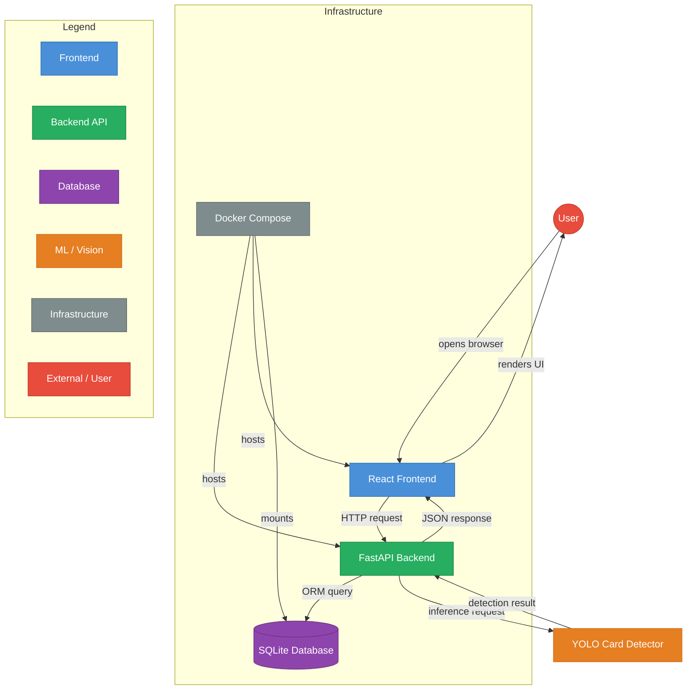
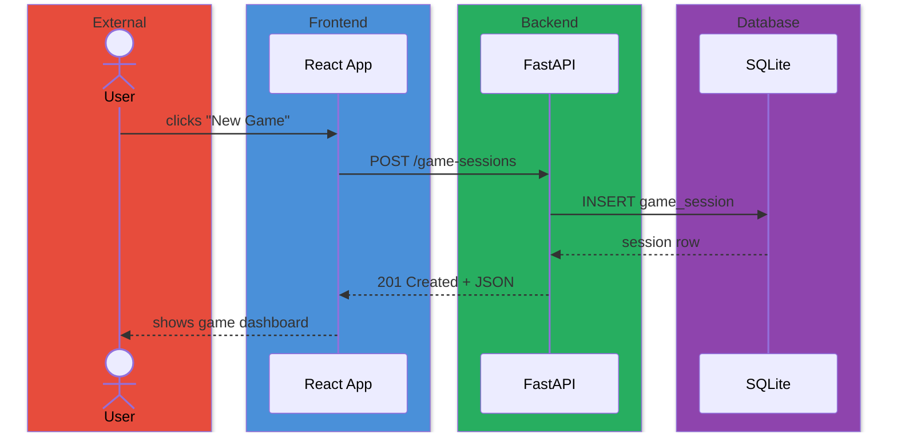

<!--
DEPRECATED — Mermaid styling rules have moved to an instruction file.
See: .github/instructions/kurt-mermaid.instructions.md

This file is no longer the source of truth for mermaid diagram conventions.
-->

# DEPRECATED — Mermaid Style Guide

> **Moved to `.github/instructions/kurt-mermaid.instructions.md`**
>
> Mermaid styling is now an instruction loaded by Kurt automatically,
> not a template. The instruction file contains the full color palette,
> legend format, node shapes, edge conventions, and format selection guidance.

---

## Color Palette & System-Phase Legend

Every diagram MUST include a legend subgraph that maps colors to system phases.
Use these exact hex codes and class names.

| Phase | Class Name | Fill | Stroke | Text | Use For |
|---|---|---|---|---|---|
| Frontend (React/TS) | `fe` | `#4A90D9` | `#2C6FB3` | `#FFFFFF` | UI components, pages, stores, hooks, browser |
| Backend API (FastAPI) | `be` | `#27AE60` | `#1E8449` | `#FFFFFF` | Routes, endpoints, middleware, services |
| Database (SQLAlchemy) | `db` | `#8E44AD` | `#6C3483` | `#FFFFFF` | Models, tables, queries, migrations |
| ML / Vision (YOLO) | `ml` | `#E67E22` | `#CA6F1E` | `#FFFFFF` | Detection, training, inference, models |
| Infrastructure (Docker/CI) | `infra` | `#7F8C8D` | `#616A6B` | `#FFFFFF` | Containers, CI pipelines, config, networking |
| External / User | `ext` | `#E74C3C` | `#C0392B` | `#FFFFFF` | User actions, external APIs, third-party services |

### classDef Block (copy into every diagram)

```
classDef fe fill:#4A90D9,stroke:#2C6FB3,color:#FFFFFF
classDef be fill:#27AE60,stroke:#1E8449,color:#FFFFFF
classDef db fill:#8E44AD,stroke:#6C3483,color:#FFFFFF
classDef ml fill:#E67E22,stroke:#CA6F1E,color:#FFFFFF
classDef infra fill:#7F8C8D,stroke:#616A6B,color:#FFFFFF
classDef ext fill:#E74C3C,stroke:#C0392B,color:#FFFFFF
```

### Legend Subgraph (copy into every diagram)

```
subgraph Legend
    direction LR
    L1[Frontend]:::fe
    L2[Backend API]:::be
    L3[Database]:::db
    L4[ML / Vision]:::ml
    L5[Infrastructure]:::infra
    L6[External / User]:::ext
end
```

---

## Node Shape Conventions

| Shape | Syntax | Use For |
|---|---|---|
| Rectangle | `[Node]` | Processes, services, modules |
| Rounded rectangle | `(Node)` | User actions, soft entry points |
| Cylinder | `[(Node)]` | Databases, persistent storage |
| Hexagon | `{{Node}}` | Decision points, conditional logic |
| Stadium | `([Node])` | Events, triggers, signals |
| Parallelogram | `[/Node/]` | Data input/output |
| Trapezoid | `[/Node\]` | Transformations, processing steps |
| Circle | `((Node))` | Start/end points |
| Double circle | `(((Node)))` | External system boundary |

---

## Edge Conventions

| Edge Style | Syntax | Use For |
|---|---|---|
| Solid arrow | `-->` | Primary data/control flow |
| Dotted arrow | `-.->` | Async, optional, or secondary flow |
| Thick arrow | `==>` | Critical path, high-volume flow |
| Labeled edge | `-->|label|` | Always describe what flows between nodes |

**Rules:**
- Every edge SHOULD have a label describing the data or action
- Use verb phrases for labels: `sends request`, `returns JSON`, `persists row`
- Arrows flow top-to-bottom (TD) or left-to-right (LR) — never mix directions in one diagram

---

## Diagram Type Selection

| Scenario | Diagram Type | Directive |
|---|---|---|
| System overview, data flow | Flowchart | `flowchart TD` or `flowchart LR` |
| Request/response sequences | Sequence | `sequenceDiagram` |
| Data model relationships | ER Diagram | `erDiagram` |
| Class/module structure | Class | `classDiagram` |
| State machines, lifecycles | State | `stateDiagram-v2` |
| High-level architecture | C4 Context | `C4Context` |
| Process workflows | Flowchart | `flowchart TD` |

---

## Complexity Rules

1. **Max 15 nodes per diagram** — split larger systems into multiple diagrams with cross-references
2. **Max 3 levels of subgraph nesting** — deeper nesting becomes unreadable
3. **Group related nodes** in subgraphs named after the system phase (e.g., `subgraph Backend API`)
4. **Use consistent node IDs** — lowercase, descriptive, hyphenated: `game-session-router`, `card-detector`, `sqlite-db`
5. **Always include the Legend subgraph** — positioned at the bottom of every diagram

---

## Full Example — System Overview

````markdown

````

---

## Sequence Diagram Conventions

For sequence diagrams, color is applied via participant aliases and `box` directives:

````markdown

````

---

## ER Diagram Conventions

- Use exact model/table names from `src/app/database/database_models.py`
- Relationship labels match SQLAlchemy relationship names
- Include primary keys and important columns only — skip boilerplate (`created_at`, `updated_at`) unless relevant

---

## Anti-Patterns

- **Never** use inline styles (`style N fill:...`) — always use `classDef`
- **Never** omit the Legend subgraph
- **Never** create diagrams with more than 15 nodes — split instead
- **Never** use unlabeled edges in flowcharts — every arrow describes what flows
- **Never** mix TD and LR directions in the same diagram
- **Never** use colors outside the defined palette without updating this guide first
