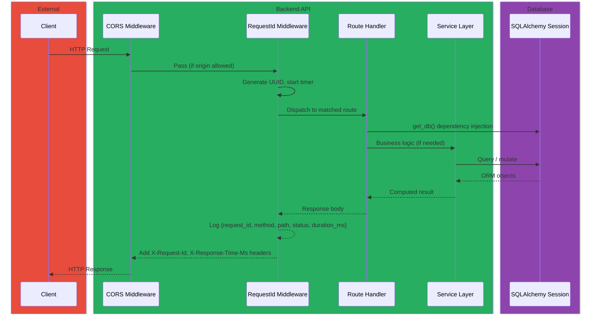
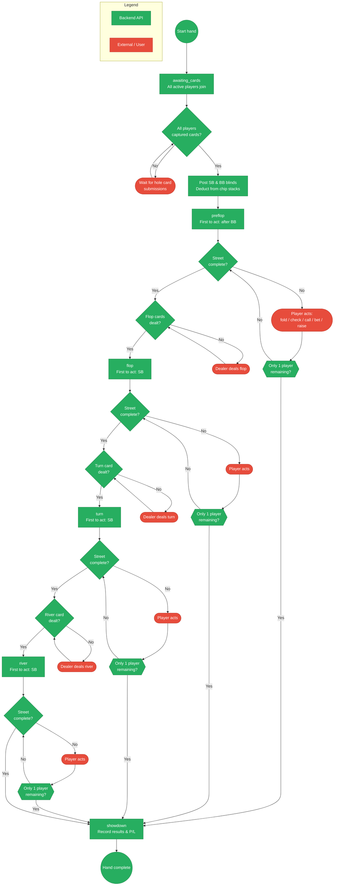

# Backend API Layer

| Field | Value |
|---|---|
| **Title** | All In Analytics — Backend API Documentation |
| **Date** | 2026-04-14 |
| **Author** | Kurt (Nightcrawler) |
| **Scope** | `src/app/routes/`, `src/app/services/`, `src/app/main.py`, `src/app/middleware.py`, `src/pydantic_models/` |
| **Status** | Current |

---

## Table of Contents

1. [Overview](#overview)
2. [Directory Structure](#directory-structure)
3. [Application Bootstrap](#application-bootstrap)
4. [Request Flow Diagram](#request-flow-diagram)
5. [Endpoint Reference](#endpoint-reference)
   - [Games](#games)
   - [Hands](#hands)
   - [Players](#players)
   - [Images & Detection](#images--detection)
   - [Upload / CSV](#upload--csv)
   - [Stats](#stats)
   - [Search](#search)
6. [Services Layer](#services-layer)
   - [Betting State Machine](#betting-state-machine)
   - [Hand State Management](#hand-state-management)
   - [Card Detector](#card-detector)
   - [Equity Calculator](#equity-calculator)
   - [Hand Evaluator](#hand-evaluator)
   - [Hand Ranking](#hand-ranking)
7. [Pydantic Schemas](#pydantic-schemas)
8. [Middleware](#middleware)
9. [Hand Lifecycle](#hand-lifecycle)

---

## Overview

The backend is a **FastAPI** application serving a REST API for managing Texas Hold'em poker sessions. It handles game session CRUD, real-time hand tracking with a full betting state machine, card detection via YOLO, equity calculation, player analytics, and data import/export (CSV and ZIP).

The API follows a resource-oriented design with consistent patterns: path parameters for resource identity, Pydantic models for request/response validation, and SQLAlchemy ORM for persistence.

---

## Directory Structure

```
src/
├── app/
│   ├── main.py              # FastAPI app, CORS config, router registration
│   ├── middleware.py         # RequestIdMiddleware (logging, timing)
│   ├── __init__.py
│   ├── database/             # See database.md
│   ├── routes/
│   │   ├── games.py          # Game session management, blinds, export
│   │   ├── hands.py          # Hand lifecycle, betting, results, equity
│   │   ├── players.py        # Player CRUD
│   │   ├── images.py         # Image upload, detection, confirmation
│   │   ├── upload.py         # CSV/ZIP import
│   │   ├── stats.py          # Player stats, leaderboard, game stats
│   │   └── search.py         # Hand search with filtering and pagination
│   └── services/
│       ├── betting.py         # NLHE action validation, side pots
│       ├── hand_state.py      # Phase advancement, turn order
│       ├── card_detector.py   # CardDetector protocol + YOLO/Mock impls
│       ├── equity.py          # Monte Carlo equity calculator
│       ├── evaluator.py       # 5-card poker hand evaluation
│       └── hand_ranking.py    # Human-readable hand descriptions
└── pydantic_models/
    ├── common.py              # Enums (Result, Street, Action, Card, CardRank, CardSuit)
    ├── game_schemas.py        # Game session request/response models
    ├── hand_schemas.py        # Hand, action, status request/response models
    ├── player_schemas.py      # Player, seat, rebuy models
    ├── detection_schemas.py   # Detection confirmation, equity response
    ├── stats_schemas.py       # Stats and leaderboard models
    ├── search_schemas.py      # Hand search and pagination models
    ├── csv_schema.py          # CSV column definitions, parsing, validation
    ├── csv_schemas.py         # CSV/ZIP commit summary models
    ├── card_validator.py      # Duplicate card validation utility
    └── app_models.py          # Backward-compatible re-export of all schemas
```

---

## Application Bootstrap

Defined in [src/app/main.py](../../src/app/main.py).

The FastAPI app is created with title `"All In Analytics Core Backend"` and version `1.0.0`. Configuration:

1. **CORS** — Origins read from `ALLOWED_ORIGINS` env var (default: `http://localhost:5173`). A regex pattern also allows any private-network IP (`192.168.*`, `10.*`, `172.16-31.*`), localhost, and `*.trycloudflare.com`. Wildcard `*` is explicitly rejected when credentials are enabled.
2. **Middleware** — `RequestIdMiddleware` is added for request tracing.
3. **Routers** — All route modules are registered via `app.include_router()`.

| Router module | Prefix | Tags |
|---|---|---|
| `games` | `/games` | `games` |
| `hands` | `/games` | `hands` |
| `images` | `/games` | `images` |
| `corrections_router` | `/images` | `images` |
| `players` | `/players` | `players` |
| `upload` | `/upload` | `upload` |
| `stats` | `/stats` | `stats` |
| `search` | `/hands` | `search` |

The root endpoint `GET /` returns a welcome message.

---

## Request Flow Diagram



---

## Endpoint Reference

### Games

Defined in [src/app/routes/games.py](../../src/app/routes/games.py). Prefix: `/games`.

| Method | Path | Description | Request Body | Response |
|---|---|---|---|---|
| `GET` | `/games` | List game sessions (optional `date_from`, `date_to` filters) | — | `list[GameSessionListItem]` |
| `POST` | `/games` | Create a game session with players | `GameSessionCreate` | `GameSessionResponse` (201) |
| `GET` | `/games/{game_id}` | Get a single game session | — | `GameSessionResponse` |
| `PATCH` | `/games/{game_id}/complete` | Mark a game as completed | `CompleteGameRequest` (optional) | `GameSessionResponse` |
| `PATCH` | `/games/{game_id}/reactivate` | Reactivate a completed game | — | `GameSessionResponse` |
| `GET` | `/games/{game_id}/blinds` | Get current blind levels and timer state | — | `BlindsResponse` |
| `PATCH` | `/games/{game_id}/blinds` | Update blinds (with pause/resume logic) | `BlindsUpdate` | `BlindsResponse` |
| `GET` | `/games/{game_id}/export/csv` | Export game data as CSV | — | `StreamingResponse` (text/csv) |
| `GET` | `/games/{game_id}/export/zip` | Export full game bundle as ZIP | — | `StreamingResponse` (application/zip) |
| `DELETE` | `/games/{game_id}` | Delete a game and all cascade data | — | 204 |

**Player management within games** (also defined in `games.py`):

| Method | Path | Description | Request Body | Response |
|---|---|---|---|---|
| `POST` | `/games/{game_id}/players` | Add player to game | `AddPlayerToGameRequest` | `AddPlayerToGameResponse` (201) |
| `PATCH` | `/games/{game_id}/players/{player_name}/status` | Toggle player active/inactive | `PlayerStatusUpdate` | `PlayerStatusResponse` |
| `PATCH` | `/games/{game_id}/players/{player_name}/seat` | Assign or swap seat | `SeatAssignmentRequest` | `PlayerInfo` |
| `PATCH` | `/games/{game_id}/players/{player_name}/buy-in` | Update buy-in amount | `{"buy_in": float}` | `PlayerInfo` |
| `POST` | `/games/{game_id}/players/{player_name}/rebuys` | Record a rebuy | `RebuyCreate` | `RebuyResponse` (201) |

**Blinds update behavior:**
- Changing `small_blind` or `big_blind` resets the timer (`blind_timer_started_at = now`, paused → false).
- Setting `blind_timer_paused = true` computes and stores `blind_timer_remaining_seconds`.
- Resuming (`blind_timer_paused = false`) adjusts `blind_timer_started_at` so elapsed time is preserved.

### Hands

Defined in [src/app/routes/hands.py](../../src/app/routes/hands.py). Prefix: `/games`.

| Method | Path | Description | Request Body | Response |
|---|---|---|---|---|
| `POST` | `/games/{game_id}/hands/start` | Start a new hand (auto-assigns SB/BB, all active players join) | — | `HandResponse` (201) |
| `POST` | `/games/{game_id}/hands` | Record a hand with optional community cards and player entries | `HandCreate` | `HandResponse` (201) |
| `GET` | `/games/{game_id}/hands` | List all hands in a game | — | `list[HandResponse]` |
| `GET` | `/games/{game_id}/hands/latest` | Get the most recent hand | — | `HandResponse \| null` |
| `GET` | `/games/{game_id}/hands/{hand_number}` | Get a single hand | — | `HandResponse` |
| `DELETE` | `/games/{game_id}/hands/{hand_number}` | Delete a hand (cascade) | — | 204 |
| `GET` | `/games/{game_id}/hands/{hand_number}/status` | Full hand status with ETag support | — | `HandStatusResponse` |
| `GET` | `/games/{game_id}/hands/{hand_number}/state` | Current betting state (phase, seat) | — | `HandStateResponse` |
| `GET` | `/games/{game_id}/hands/{hand_number}/actions` | Action history for a hand | — | `list[HandActionResponse]` |
| `GET` | `/games/{game_id}/hands/{hand_number}/equity` | Player equity (optional `?player=` filter) | — | `EquityResponse` |

**Community card endpoints:**

| Method | Path | Description |
|---|---|---|
| `PATCH` | `/games/{game_id}/hands/{hand_number}` | Set all community cards at once |
| `PATCH` | `/games/{game_id}/hands/{hand_number}/flop` | Set the three flop cards |
| `PATCH` | `/games/{game_id}/hands/{hand_number}/turn` | Set the turn card (requires flop) |
| `PATCH` | `/games/{game_id}/hands/{hand_number}/river` | Set the river card (requires flop + turn) |

**Player-in-hand endpoints:**

| Method | Path | Description |
|---|---|---|
| `POST` | `/games/{game_id}/hands/{hand_number}/players` | Add a player to an existing hand |
| `DELETE` | `/games/{game_id}/hands/{hand_number}/players/{player_name}` | Remove a player from a hand |
| `PATCH` | `/games/{game_id}/hands/{hand_number}/players/{player_name}` | Edit hole cards |
| `PATCH` | `/games/{game_id}/hands/{hand_number}/players/{player_name}/result` | Update result and P/L |
| `PATCH` | `/games/{game_id}/hands/{hand_number}/results` | Batch update results |
| `POST` | `/games/{game_id}/hands/{hand_number}/players/{player_name}/actions` | Record a betting action |

**Card duplicate validation** is enforced on every card mutation — community cards, hole cards, and cross-player checks all go through `validate_no_duplicate_cards()`.

### Players

Defined in [src/app/routes/players.py](../../src/app/routes/players.py). Prefix: `/players`.

| Method | Path | Description | Request Body | Response |
|---|---|---|---|---|
| `POST` | `/players` | Create a new player | `PlayerCreate` | `PlayerResponse` (201) |
| `GET` | `/players` | List all players | — | `list[PlayerResponse]` |
| `GET` | `/players/{player_name}` | Get player by name | — | `PlayerResponse` |

Player creation uses case-insensitive duplicate detection with `func.lower()`. A 409 is returned if the name already exists.

### Images & Detection

Defined in [src/app/routes/images.py](../../src/app/routes/images.py). Prefix: `/games` and `/images`.

| Method | Path | Description |
|---|---|---|
| `POST` | `/games/{game_id}/hands/image` | Upload a JPEG/PNG image for card detection |
| `GET` | `/games/{game_id}/hands/image/{upload_id}` | Run detection (lazy) and return results |
| `POST` | `/games/{game_id}/hands/image/{upload_id}/confirm` | Confirm detections → creates a Hand |

**Upload validation:**
- Content type must be `image/jpeg` or `image/png`
- Magic bytes are verified (JPEG: `\xff\xd8\xff`, PNG: `\x89PNG\r\n\x1a\n`)
- Maximum file size: 10 MB

Detection is lazy — the YOLO model runs on the first `GET` to the detection endpoint, not at upload time. Results are persisted as `CardDetection` records.

The correction endpoint lives on a separate router (`/images` prefix):

| Method | Path | Description |
|---|---|---|
| `POST` | `/images/{upload_id}/corrections` | Submit a correction to a detection |

### Upload / CSV

Defined in [src/app/routes/upload.py](../../src/app/routes/upload.py). Prefix: `/upload`.

| Method | Path | Description | Response |
|---|---|---|---|
| `GET` | `/upload/csv/schema` | Return CSV column definitions and format hints | JSON |
| `POST` | `/upload/csv` | Validate a CSV file (dry run) | Validation report |
| `POST` | `/upload/csv/commit` | Validate and bulk-commit CSV data | `CSVCommitSummary` (201) |
| `POST` | `/upload/zip/commit` | Import a full game ZIP bundle | `ZipCommitSummary` (201) |

CSV format uses columns: `game_date`, `hand_number`, `player_name`, `hole_card_1`, `hole_card_2`, `flop_1`–`flop_3`, `turn`, `river`, `result`, `profit_loss`, `outcome_street`, `is_all_in`.

### Stats

Defined in [src/app/routes/stats.py](../../src/app/routes/stats.py). Prefix: `/stats`.

| Method | Path | Description | Response |
|---|---|---|---|
| `GET` | `/stats/players/{player_name}` | Per-player statistics | `PlayerStatsResponse` |
| `GET` | `/stats/leaderboard` | Global leaderboard (sortable by `metric` param) | `list[LeaderboardEntry]` |
| `GET` | `/stats/games/{game_id}` | Per-game statistics breakdown | `GameStatsResponse` |

**Player stats include:** total hands, win/loss/fold counts, win rate, total P/L, average P/L per hand and session, street survival percentages (flop/turn/river).

**Leaderboard metrics:** `total_profit_loss` (default), `win_rate`, `hands_played`.

The `handed_back` result is excluded from all stat calculations.

### Search

Defined in [src/app/routes/search.py](../../src/app/routes/search.py). Prefix: `/hands`.

| Method | Path | Description |
|---|---|---|
| `GET` | `/hands` | Search hands with multi-criteria filtering |

**Query parameters:**

| Parameter | Type | Description |
|---|---|---|
| `player` | `str` | Filter by player name (case-insensitive) |
| `date_from` | `date` | Inclusive start date |
| `date_to` | `date` | Inclusive end date |
| `card` | `str` | Search for a specific card (e.g. `AS`) |
| `location` | `community \| hole` | Narrow card search location |
| `page` | `int` | Page number (default 1) |
| `per_page` | `int` | Results per page (default 50, max 200) |

Returns `PaginatedHandSearchResponse` with `total`, `page`, `per_page`, and `results`.

---

## Services Layer

### Betting State Machine

Defined in [src/app/services/betting.py](../../src/app/services/betting.py).

Implements No-Limit Hold'em action validation:

| Function | Purpose |
|---|---|
| `get_legal_actions(phase, actions, player_id, blinds)` | Returns legal actions, amount to call, minimum bet/raise for a player |
| `validate_action(action, amount, legal_actions, ...)` | Returns `None` if valid or an error message string |
| `compute_side_pots(contributions, all_in_ids, non_folded_ids)` | Computes side pots when all-in players are present |
| `is_street_complete(actions, active_ids, all_in_ids, phase, bb_id)` | Checks if all players have acted with equalized betting |

**Legal action logic:**
- If `amount_to_call > 0`: legal actions are `fold`, `call`, `raise`
- If no wager on the street: `fold`, `check`, `bet`
- If wager exists but equalized: `fold`, `check`, `raise` (BB option preflop)

Minimum raise is computed as `amount_to_call + last_raise_increment` where the last raise increment tracks the size of the most recent raise (minimum: big blind).

### Hand State Management

Defined in [src/app/services/hand_state.py](../../src/app/services/hand_state.py).

Manages turn order and phase progression through the hand lifecycle.

| Function | Purpose |
|---|---|
| `get_active_seat_order(db, game_id, hand)` | Returns `(seat, player_id)` pairs for non-folded active players |
| `first_to_act_seat(db, game_id, hand, phase)` | Determines first-to-act: after BB (preflop) or from SB (post-flop) |
| `next_seat(db, game_id, hand, current_seat)` | Advances to next non-folded, non-all-in player |
| `try_advance_phase(db, game_id, hand, state)` | Checks if betting is complete and advances to the next phase |
| `activate_preflop(db, game_id, hand, state)` | Transitions from `awaiting_cards` to `preflop`, posts blinds |
| `count_community_cards(hand)` | Counts dealt community cards (0–5) |
| `can_advance_to_phase(hand, target)` | Checks if community cards support the target phase |

**Phase order:** `awaiting_cards` → `preflop` → `flop` → `turn` → `river` → `showdown`

Phase advancement is **card-gated** — the hand won't advance to `flop` until three community cards exist, won't advance to `turn` until four exist, etc. If cards aren't dealt yet, the state parks at the phase boundary with `current_seat = None`.

### Card Detector

Defined in [src/app/services/card_detector.py](../../src/app/services/card_detector.py).

Uses a `Protocol` for dependency injection:

| Implementation | Description |
|---|---|
| `CardDetector` (Protocol) | `detect(image_path) → list[dict]` |
| `MockCardDetector` | Returns 7 random cards with random confidence — used when no model weights are available |
| `YoloCardDetector` | Multi-scale YOLO inference (480px and 640px). Deduplicates by card value (keeps highest confidence). Confidence threshold: 0.20 |

Model weights are loaded from `models/best_closeup.pt` (preferred) or `models/best.pt` (fallback).

### Equity Calculator

Defined in [src/app/services/equity.py](../../src/app/services/equity.py).

| Function | Purpose |
|---|---|
| `calculate_equity(player_hole_cards, community_cards)` | Multi-player equity (exhaustive for ≤2 remaining cards, Monte Carlo 5000 iterations otherwise) |
| `calculate_player_equity(hole_cards, num_opponents, community_cards)` | Single-player equity vs random opponent hands (Monte Carlo 5000 iterations) |

Returns equity values between 0.0 and 1.0, summing to 1.0 across all players.

### Hand Evaluator

Defined in [src/app/services/evaluator.py](../../src/app/services/evaluator.py).

The shared 5-card poker hand evaluator, extracted to eliminate duplication:

| Function | Purpose |
|---|---|
| `classify5(c0..c4)` | Classify 5 cards → `(category, kickers)` |
| `score(cat, kickers)` | Numeric score for hand comparison (higher = better) |
| `eval5(c0..c4)` | Score a 5-card hand directly |
| `best_hand(cards)` | Best 5-card hand from 5–7 cards → `(category, group_ranks)` |
| `best_score(cards)` | Numeric score of the best 5-card hand |

**Hand categories:** 0=High Card, 1=Pair, 2=Two Pair, 3=Trips, 4=Straight, 5=Flush, 6=Full House, 7=Quads, 8=Straight Flush

### Hand Ranking

Defined in [src/app/services/hand_ranking.py](../../src/app/services/hand_ranking.py).

| Function | Purpose |
|---|---|
| `describe_hand(hole_cards, community_cards)` | Returns a human-readable description (e.g. "Pair of Aces", "Full House, Kings full of Tens", "Royal Flush") |

Requires at least 5 total cards. Returns `None` if insufficient.

---

## Pydantic Schemas

All schemas live in `src/pydantic_models/` and use Pydantic v2. The `app_models.py` module re-exports everything for backward compatibility.

### Common Types

Defined in [src/pydantic_models/common.py](../../src/pydantic_models/common.py).

| Type | Kind | Values |
|---|---|---|
| `PlayerName` | Annotated `str` | Stripped whitespace, min length 1 |
| `ResultEnum` | Enum | `won`, `lost`, `folded`, `handed_back` |
| `StreetEnum` | Enum | `preflop`, `flop`, `turn`, `river` |
| `ActionEnum` | Enum | `fold`, `check`, `call`, `bet`, `raise` |
| `CardRank` | Enum | `A`, `2`–`10`, `J`, `Q`, `K` |
| `CardSuit` | Enum | `S`, `H`, `D`, `C` |
| `Card` | BaseModel | `rank: CardRank`, `suit: CardSuit` with string representation |

### Schema Files

| File | Key Schemas |
|---|---|
| `game_schemas.py` | `GameSessionCreate`, `GameSessionResponse`, `GameSessionListItem`, `CompleteGameRequest`, `BlindsResponse`, `BlindsUpdate` |
| `hand_schemas.py` | `HandCreate`, `HandResponse`, `HandStatusResponse`, `HandStateResponse`, `PlayerHandEntry`, `PlayerHandResponse`, `PlayerActionCreate`, `CommunityCardsUpdate`, `FlopUpdate`, `TurnUpdate`, `RiverUpdate`, `HoleCardsUpdate`, `PlayerResultUpdate`, `PlayerResultEntry` |
| `player_schemas.py` | `PlayerCreate`, `PlayerResponse`, `PlayerInfo`, `AddPlayerToGameRequest`, `RebuyCreate`, `RebuyResponse`, `SeatAssignmentRequest`, `PlayerStatusUpdate` |
| `detection_schemas.py` | `ConfirmDetectionRequest`, `ConfirmCommunityCards`, `ConfirmPlayerEntry`, `EquityResponse`, `PlayerEquityEntry` |
| `stats_schemas.py` | `PlayerStatsResponse`, `LeaderboardEntry`, `LeaderboardMetric`, `GameStatsResponse`, `GameStatsPlayerEntry` |
| `search_schemas.py` | `HandSearchResult`, `PaginatedHandSearchResponse` |
| `csv_schema.py` | `CSV_COLUMNS`, `parse_csv()`, `validate_csv_rows()`, `is_valid_card()` |
| `csv_schemas.py` | `CSVCommitSummary`, `ZipCommitSummary` |
| `card_validator.py` | `validate_no_duplicate_cards()` |

---

## Middleware

Defined in [src/app/middleware.py](../../src/app/middleware.py).

### RequestIdMiddleware

Applied to every request. Behavior:

1. Generates a `UUID4` request ID
2. Starts a high-resolution timer (`time.perf_counter()`)
3. Passes the request to the next handler
4. Adds `X-Request-Id` and `X-Response-Time-Ms` headers to the response
5. Logs a structured JSON entry with `request_id`, `method`, `path`, `status_code`, and `duration_ms`
6. Log level: `error` for 5xx, `warning` for 4xx, `info` otherwise

On unhandled exceptions, returns a generic 500 response with the request ID header for traceability.

---

## Hand Lifecycle

The complete lifecycle of a live-dealt hand:



**Key behaviors during the hand lifecycle:**

1. **Card-gated advancement** — Phase transitions only occur when the required community cards are present. The system parks at `current_seat = None` between streets until the dealer submits cards.
2. **Turn-order enforcement** — The `record_player_action` endpoint validates that the acting player matches `hand_state.current_seat`. A `?force=true` query parameter bypasses this for manual corrections.
3. **All-in detection** — Explicit via `is_all_in: true` in the action payload, or auto-detected when a call amount is less than the required amount to call.
4. **Side pot computation** — Triggered after any action when all-in players exist. Stored as JSON in `Hand.side_pots`.
5. **Fold-to-one** — When all but one player folds, the remaining player immediately wins and the phase jumps to `showdown`.
6. **Chip stack tracking** — Every monetary action (call, bet, raise, blind) deducts from `GamePlayer.current_chips`. Result recording credits chips back based on contribution + P/L.
7. **ETag support** — The `/status` endpoint generates ETags from `hand_id`, `updated_at`, `phase`, and `pot`. Clients can send `If-None-Match` to receive 304 responses for unchanged state, reducing polling overhead.
