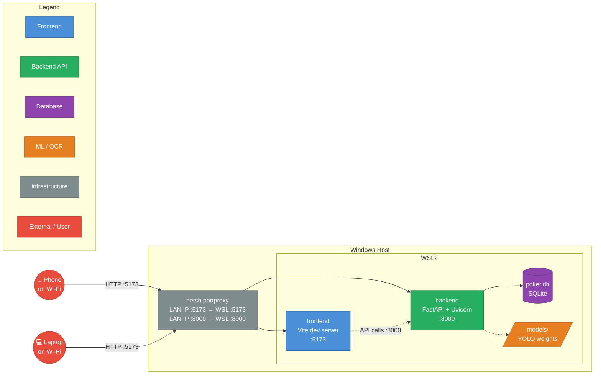
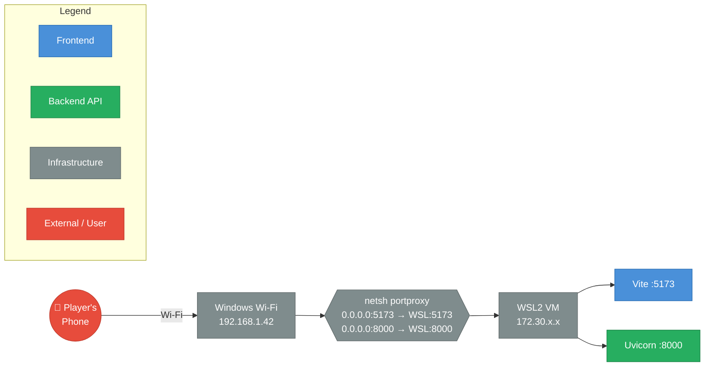

# Deployment & Local Network Sharing

| Field | Value |
|---|---|
| **Title** | All In Analytics — Docker Compose & WSL Network Sharing |
| **Date** | 2026-04-14 |
| **Author** | Kurt (Nightcrawler) |
| **Scope** | `docker-compose.yml`, `Dockerfile`, `Dockerfile.gpu`, `frontend/Dockerfile`, `docker-entrypoint.sh`, `scripts/share.sh`, `scripts/unshare.sh` |
| **Status** | Current |

---

## Table of Contents

1. [Overview](#overview)
2. [Service Architecture](#service-architecture)
3. [Docker Compose Services](#docker-compose-services)
4. [Dockerfiles](#dockerfiles)
5. [Entrypoint Script](#entrypoint-script)
6. [Environment Variables](#environment-variables)
7. [Volume Mounts](#volume-mounts)
8. [Starting the Stack](#starting-the-stack)
9. [WSL Network Sharing](#wsl-network-sharing)

---

## Overview

The application runs as a two-container stack: a **Python/FastAPI backend** (with CPU or GPU variants) and a **Node.js/Vite frontend**. Docker Compose manages both services with bind-mounted source directories for live-reload during development.

For poker nights, the `share.sh` script exposes the stack to other devices on the local Wi-Fi network by configuring Windows port forwarding from within WSL.

---

## Service Architecture



---

## Docker Compose Services

Defined in [docker-compose.yml](../docker-compose.yml). Three services, two profiles.

| Service | Profile | Base Image | Port | Purpose |
|---|---|---|---|---|
| `backend` | `cpu` | `python:3.12` ([Dockerfile](../Dockerfile)) | 8000 | FastAPI backend with CPU-only PyTorch |
| `backend-gpu` | `gpu` | `nvidia/cuda:12.1.0-runtime-ubuntu22.04` ([Dockerfile.gpu](../Dockerfile.gpu)) | 8000 | FastAPI backend with CUDA 12.1 PyTorch |
| `frontend` | *(default)* | `node:22-alpine` ([frontend/Dockerfile](../frontend/Dockerfile)) | 5173 | Vite dev server |

The `backend` and `backend-gpu` services share the same volume mounts (via YAML anchor `&backend-volumes`) and environment variables (via `&backend-env`). They never run simultaneously — use one profile or the other.

The `backend-gpu` service has a network alias `backend` so the frontend can reach it at the same hostname regardless of which profile is active. It reserves one NVIDIA GPU via Docker's device reservation.

The `frontend` service has no profile — it starts with either `cpu` or `gpu`.

---

## Dockerfiles

### Backend CPU — [Dockerfile](../Dockerfile)

| Stage | What happens |
|---|---|
| Base image | `python:3.12` |
| uv install | Copied from `ghcr.io/astral-sh/uv:latest` |
| System deps | `libgl1`, `libglib2.0-0` (OpenCV requirements for ultralytics) |
| Dependency cache | `pyproject.toml` + `uv.lock` copied early; `uv sync --frozen --group test` runs on stubs |
| PyTorch | CPU-only wheels from `download.pytorch.org/whl/cpu` |
| ultralytics | Installed into the project venv |
| Entrypoint | [docker-entrypoint.sh](../docker-entrypoint.sh) |

### Backend GPU — [Dockerfile.gpu](../Dockerfile.gpu)

| Stage | What happens |
|---|---|
| Base image | `nvidia/cuda:12.1.0-runtime-ubuntu22.04` |
| Python 3.12 | Installed from `ppa:deadsnakes` |
| System deps | Same as CPU + `curl`, `python3.12-dev` |
| PyTorch | CUDA 12.1 wheels from `download.pytorch.org/whl/cu121` |
| NVIDIA env | `NVIDIA_VISIBLE_DEVICES=all`, `NVIDIA_DRIVER_CAPABILITIES=compute,utility` |
| Entrypoint | Same [docker-entrypoint.sh](../docker-entrypoint.sh) |

### Frontend — [frontend/Dockerfile](../frontend/Dockerfile)

| Stage | What happens |
|---|---|
| Base image | `node:22-alpine` |
| Dependencies | `npm install` from `package.json` |
| Build check | `npm run build` verifies TypeScript compilation |
| Runtime | `npm run dev` — Vite dev server with HMR |

---

## Entrypoint Script

Defined in [docker-entrypoint.sh](../docker-entrypoint.sh). Runs on every backend container start.

```
1. mkdir -p /app/uploads
2. If SEED_DATA=1:
   - Switch to ephemeral demo.db (poker.db untouched)
   - Delete any previous demo.db
3. Run Alembic migrations (alembic upgrade head)
4. If SEED_DATA=1:
   - Run seed_demo_game.py
5. Start uvicorn with --reload on 0.0.0.0:8000
```

The `SEED_DATA=1` mode creates a throwaway `demo.db` for demonstration purposes without touching the real `poker.db`. This is useful for demos and testing.

---

## Environment Variables

| Variable | Default | Purpose |
|---|---|---|
| `PYTHONPATH` | `/app/src` | Makes `app` and `pydantic_models` packages importable |
| `DATABASE_URL` | `sqlite:///./poker.db` | SQLAlchemy database URL |
| `SEED_DATA` | `0` | Set to `1` to seed demo data on startup |
| `ALLOWED_ORIGINS` | `http://localhost:5173,...` | Comma-separated CORS origins |

The `ALLOWED_ORIGINS` value in docker-compose includes three localhost variants to cover different browser/Docker networking scenarios:

| Origin | When used |
|---|---|
| `http://localhost:5173` | Browser accessing frontend directly |
| `http://0.0.0.0:5173` | Docker-internal access |
| `http://127.0.0.1:5173` | Loopback access |

Additional private-network origins (`192.168.*`, `10.*`, etc.) are handled by a regex in `main.py` — no env var needed for LAN access.

---

## Volume Mounts

All backend volume mounts use bind mounts for live-reload during development.

### Backend Volumes

| Host Path | Container Path | Purpose |
|---|---|---|
| `./src` | `/app/src` | Application source code (live-reload) |
| `./alembic` | `/app/alembic` | Migration scripts |
| `./alembic.ini` | `/app/alembic.ini` | Alembic configuration |
| `./pyproject.toml` | `/app/pyproject.toml` | Project metadata and dependencies |
| `./uv.lock` | `/app/uv.lock` | Locked dependency versions |
| `./docker-entrypoint.sh` | `/app/docker-entrypoint.sh` | Entrypoint script |
| `./scripts` | `/app/scripts` | Utility scripts (seed, etc.) |
| `./models` | `/app/models` | YOLO model weights |
| `./poker.db` | `/app/poker.db` | SQLite database file |
| `./uploads` | `/app/uploads` | Uploaded images for card detection |

### Frontend Volumes

| Host Path | Container Path | Purpose |
|---|---|---|
| `./frontend/src` | `/app/src` | React/TypeScript source (HMR) |
| `./frontend/index.html` | `/app/index.html` | Entry HTML |
| `./frontend/public` | `/app/public` | Static assets |
| `./frontend/vite.config.ts` | `/app/vite.config.ts` | Vite configuration |
| `./frontend/tsconfig.json` | `/app/tsconfig.json` | TypeScript configuration |

---

## Starting the Stack

### CPU mode (default)

```bash
docker compose --profile cpu up --build
```

### GPU mode (NVIDIA GPU required)

```bash
docker compose --profile gpu up --build
```

Requires the [NVIDIA Container Toolkit](https://docs.nvidia.com/datacenter/cloud-native/container-toolkit/install-guide.html) to be installed on the host.

### With demo data

```bash
SEED_DATA=1 docker compose --profile cpu up --build
```

### Frontend only (for frontend development against a local backend)

```bash
docker compose up frontend --build
```

---

## WSL Network Sharing

Two scripts in `scripts/` enable sharing the running application with other devices on the same Wi-Fi network. This is designed for **Windows Subsystem for Linux (WSL2)**, where the Docker containers run inside a WSL VM that isn't directly reachable from the LAN.

### The Problem

```
Phone on Wi-Fi → Windows LAN IP:5173 → ??? → WSL2 VM:5173
```

WSL2 runs in a Hyper-V VM with its own virtual network adapter. Other devices on the Wi-Fi can reach the Windows host IP, but not the WSL internal IP. Port forwarding bridges this gap.

### share.sh

Defined in [scripts/share.sh](../scripts/share.sh). Run from within WSL:

```bash
./scripts/share.sh
```

What it does:

1. **Gets the WSL IP** — `hostname -I` returns the WSL2 VM's internal IP (e.g. `172.30.x.x`)
2. **Resets existing port forwarding** — Clears any stale `netsh portproxy` rules
3. **Creates two port-forward rules** via PowerShell calling `netsh`:
   - `0.0.0.0:5173` → `WSL_IP:5173` (frontend)
   - `0.0.0.0:8000` → `WSL_IP:8000` (backend API)
4. **Discovers the Windows Wi-Fi IP** — Queries `Get-NetIPAddress` for the Wi-Fi adapter's IPv4 address
5. **Prints the shareable URL** — e.g. `http://192.168.1.42:5173`

Players on the same Wi-Fi can then open that URL on their phones to access the dealer interface.

### unshare.sh

Defined in [scripts/unshare.sh](../scripts/unshare.sh). Tears down the port forwarding:

```bash
./scripts/unshare.sh
```

Runs `netsh interface portproxy reset` via PowerShell to remove all forwarding rules.

### Port Forwarding Diagram



### Prerequisites

- **Windows 10/11** with WSL2 enabled
- **Administrator privileges** — `netsh portproxy` requires elevation. The script calls PowerShell from WSL, which inherits the WSL terminal's privilege level. If permissions fail, run your WSL terminal as Administrator.
- **Windows Firewall** — Ports 5173 and 8000 must be allowed through the Windows firewall for inbound connections. You may need to add rules:
  ```powershell
  # Run in an elevated PowerShell
  New-NetFirewallRule -DisplayName "AIA Frontend" -Direction Inbound -LocalPort 5173 -Protocol TCP -Action Allow
  New-NetFirewallRule -DisplayName "AIA Backend"  -Direction Inbound -LocalPort 8000 -Protocol TCP -Action Allow
  ```

### Troubleshooting

| Symptom | Cause | Fix |
|---|---|---|
| Phone can't reach the URL | Windows Firewall blocking ports | Add inbound rules for 5173 and 8000 |
| `netsh` command fails | WSL terminal not elevated | Restart terminal as Administrator |
| Wrong LAN IP printed | Multiple network adapters | Script filters for `Wi-Fi` interface; if yours is named differently (e.g. `Ethernet`), edit the `InterfaceAlias` filter in `share.sh` |
| Connection works briefly then breaks | WSL IP changed after reboot | Re-run `./scripts/share.sh` — WSL2 gets a new IP on each boot |
| CORS error in browser | Frontend URL doesn't match `ALLOWED_ORIGINS` | The `main.py` regex already allows private IPs; if using a custom domain, add it to `ALLOWED_ORIGINS` |
