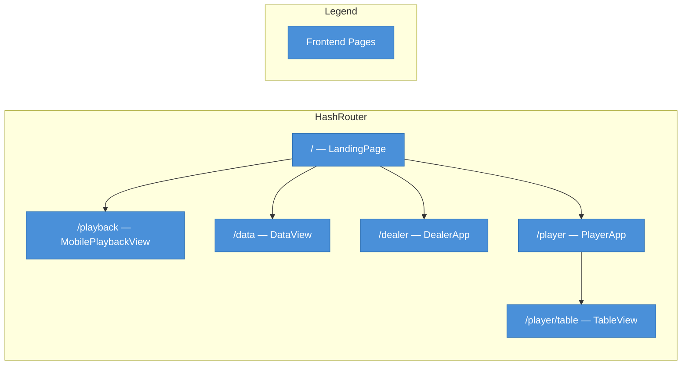
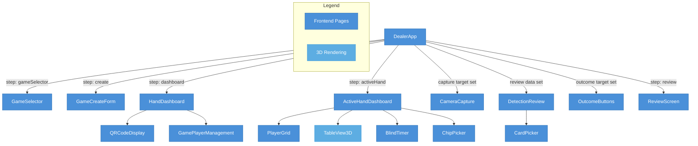
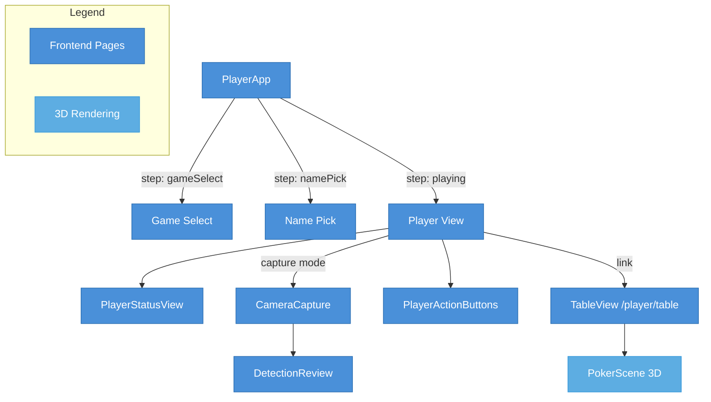
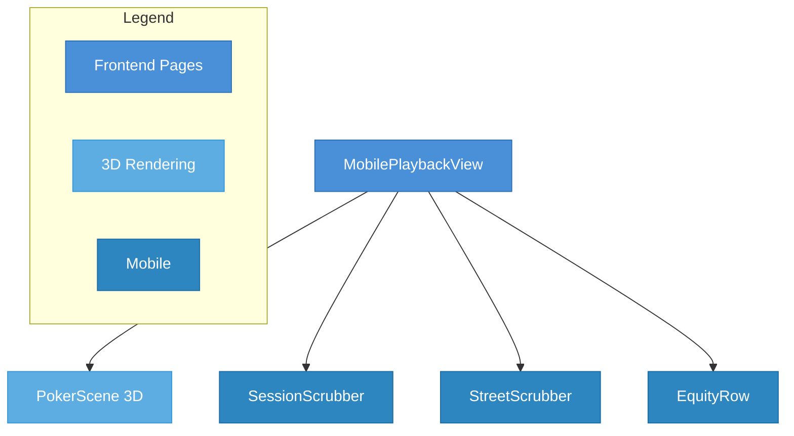
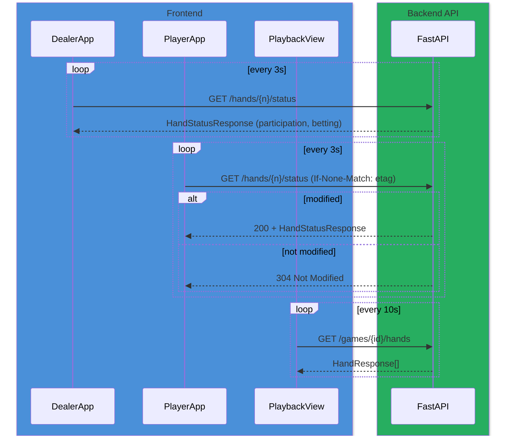
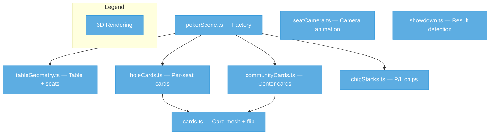

# Frontend Architecture — All In Analytics

| Field | Value |
|---|---|
| **Title** | Frontend Architecture |
| **Date** | 2026-04-14 |
| **Author** | Kurt (Nightcrawler) |
| **Scope** | `frontend/src/` — all layers |
| **Status** | Current |

---

## Table of Contents

1. [Overview](#overview)
2. [Tech Stack](#tech-stack)
3. [Directory Structure](#directory-structure)
4. [Routing](#routing)
5. [Component Hierarchy](#component-hierarchy)
6. [State Management](#state-management)
7. [API Client Layer](#api-client-layer)
8. [Polling Architecture](#polling-architecture)
9. [3D Rendering (Three.js)](#3d-rendering-threejs)
10. [Poker Logic](#poker-logic)
11. [Mobile Adaptations](#mobile-adaptations)
12. [Build & Dev](#build--dev)
13. [Testing](#testing)
14. [Cross-References](#cross-references)

---

## Overview

The All In Analytics frontend is a React 19 + TypeScript single-page application that provides three distinct user experiences:

- **Dealer interface** — run a live poker game: create sessions, start hands, capture cards via camera, record outcomes, manage player participation and betting
- **Player interface** — join a session via QR code, capture hole cards, submit betting actions, and view a personalized 3D table
- **Playback / Data interface** — review recorded sessions with a 3D poker table, scrub through hands and streets, and import/export data via CSV or ZIP

All three share a common API client, Zustand state store, Three.js scene engine, and component library.

---

## Tech Stack

| Layer | Technology | Version |
|---|---|---|
| UI framework | React | 19.1 |
| Language | TypeScript | 5.8 |
| Build tool | Vite | 8.0 |
| Routing | react-router-dom (HashRouter) | 7.5 |
| State | Zustand (with `persist` middleware) | 5.0 |
| 3D rendering | Three.js + OrbitControls | 0.183 |
| QR codes | qrcode | 1.5 |
| Test runner | Vitest + @testing-library/react | 4.1 / 16.3 |
| DOM environment | happy-dom | 20.8 |
| Linter | ESLint + @typescript-eslint | 9.x / 8.x |

---

## Directory Structure

```
frontend/src/
├── main.tsx                  # ReactDOM entry point
├── App.tsx                   # Root component — HashRouter + Routes
├── NavBar.tsx                # Top navigation bar
├── style.css                 # Global CSS custom properties & resets
│
├── api/                      # ── API Client Layer ──
│   ├── client.ts             # 40+ typed fetch functions
│   └── types.ts              # ~40 TypeScript interfaces (mirrors Pydantic)
│
├── hooks/                    # ── Custom Hooks ──
│   ├── usePolling.ts         # Generic interval polling with reconnection
│   └── useHandPolling.ts     # Hand-specific polling with auto-advance
│
├── stores/                   # ── State Management ──
│   └── dealerStore.ts        # Zustand store (persisted to sessionStorage)
│
├── dealer/                   # ── Dealer Interface ──
│   ├── DealerApp.tsx         # Orchestrator — step-based wizard
│   ├── GameSelector.tsx      # Game list + selection
│   ├── GameCreateForm.tsx    # New game form (date, players, buy-in)
│   ├── HandDashboard.tsx     # Hand list, start hand, end game
│   ├── ActiveHandDashboard.tsx  # Live hand: player tiles, betting, 3D toggle
│   ├── CameraCapture.tsx     # Camera input → upload → detection
│   ├── DetectionReview.tsx   # Review/correct detected cards
│   ├── CardPicker.tsx        # Manual 52-card grid selector
│   ├── ChipPicker.tsx        # Chip denomination selector
│   ├── OutcomeButtons.tsx    # Won / Folded / Lost / Not Playing
│   ├── ReviewScreen.tsx      # Editable hand review before finish
│   ├── PlayerGrid.tsx        # Player + street tile grid
│   ├── QRCodeDisplay.tsx     # QR code for player join URL
│   ├── GamePlayerManagement.tsx  # Add/remove/toggle players mid-game
│   ├── TableView3D.tsx       # Embedded 3D table in dealer view
│   ├── BlindTimer.tsx        # Blind level countdown timer
│   ├── DealerPreview.tsx     # Collapsed 3D preview with equity
│   ├── dealerState.ts        # Legacy reducer types (re-exports from store)
│   └── showdownHelpers.ts    # Outcome inference from equity data
│
├── player/                   # ── Player Interface ──
│   ├── PlayerApp.tsx         # Orchestrator — game select → play
│   └── PlayerActionButtons.tsx  # Fold / Check / Call / Bet / Raise
│
├── views/                    # ── Full-Page Views ──
│   ├── LandingPage.tsx       # Home page with navigation cards
│   ├── DataView.tsx          # Session list, CSV/ZIP upload, CRUD
│   ├── PlaybackView.tsx      # Desktop 3D playback + equity overlay
│   └── MobilePlaybackView.tsx   # Mobile-optimized 3D playback
│
├── pages/                    # ── Route Pages ──
│   └── TableView.tsx         # Per-player 3D table (polled updates)
│
├── components/               # ── Shared Components ──
│   ├── SessionScrubber.tsx   # Hand navigation (range slider + buttons)
│   ├── StreetScrubber.tsx    # Street navigation (5 buttons)
│   ├── EquityOverlay.tsx     # Per-seat equity badges over 3D scene
│   ├── PlayingCard.tsx       # Visual card with rank + suit
│   ├── HandEditForm.tsx      # Inline community/hole card editor
│   ├── SeatPicker.tsx        # Oval seat selection layout
│   ├── StatsSidebar.tsx      # Cumulative P/L table
│   ├── ResultOverlay.tsx     # Hand result popup
│   ├── BlindPositionDisplay.tsx  # SB/BB labels + blind level
│   ├── SessionForm.tsx       # Session creation form (non-dealer)
│   ├── PlayerManagement.tsx  # Player CRUD list
│   └── cardUtils.ts          # Card validation / normalization
│
├── scenes/                   # ── Three.js Scene Modules ──
│   ├── pokerScene.ts         # Scene factory (renderer, camera, controls)
│   ├── tableGeometry.ts      # Elliptical table mesh + seat positions
│   ├── cards.ts              # Card mesh with CanvasTexture rendering
│   ├── holeCards.ts          # Per-seat hole card layout + fold sprite
│   ├── communityCards.ts     # Community card layout + slide animation
│   ├── chipStacks.ts         # Animated chip stacks (P/L visualization)
│   ├── showdown.ts           # Showdown detection utility
│   └── seatCamera.ts         # Camera position + animation per seat
│
├── poker/                    # ── Poker Logic ──
│   └── evaluator.ts          # Hand evaluator + Monte Carlo equity
│
├── mobile/                   # ── Mobile-Specific Components ──
│   ├── EquityRow.tsx         # Horizontal scrollable equity cards
│   ├── SessionScrubber.tsx   # Touch-friendly hand nav (48px targets)
│   └── StreetScrubber.tsx    # Touch-friendly street nav (48px targets)
│
└── test/                     # ── Test Setup ──
    └── setup.ts              # Vitest global setup
```

---

## Routing

The app uses `HashRouter` — all routes are prefixed with `#/` in the URL.

| Route | Component | Purpose |
|---|---|---|
| `/` | `LandingPage` | Home screen — navigation cards to each section |
| `/playback` | `MobilePlaybackView` | Session replay with 3D scene + scrubbers |
| `/data` | `DataView` | Session list, create game, CSV/ZIP import/export |
| `/dealer` | `DealerApp` | Dealer interface — full game management |
| `/player` | `PlayerApp` | Player interface — join and play |
| `/player/table` | `TableView` | Per-player 3D table with seat camera |

The `NavBar` renders navigation links and disables the Playback link when a dealer game is active (to prevent stale state conflicts).



---

## Component Hierarchy

### Dealer Flow

The `DealerApp` orchestrates a step-based wizard. The `currentStep` field in the Zustand store drives which component renders.



**Dealer step transitions:**

| Step | Component | Next Step |
|---|---|---|
| `gameSelector` | `GameSelector` | `create` or `dashboard` |
| `create` | `GameCreateForm` | `dashboard` |
| `dashboard` | `HandDashboard` | `activeHand` (on hand select/start) |
| `activeHand` | `ActiveHandDashboard` | `review` (on finish) or camera/outcome |
| `review` | `ReviewScreen` | `dashboard` (on save) |

### Player Flow



### Playback Flow



---

## State Management

### Zustand Store — `dealerStore.ts`

The primary application state is managed by a single Zustand store with `persist` middleware, which writes to `sessionStorage` (survives page refreshes within a tab).

**State shape:**

| Field | Type | Purpose |
|---|---|---|
| `gameId` | `number \| null` | Active game session ID |
| `currentHandId` | `number \| null` | Current hand number |
| `players` | `Player[]` | Player name, cards, status, outcome |
| `community` | `CommunityCards` | Flop/turn/river cards + recorded flags |
| `currentStep` | `string` | Wizard step: `gameSelector`, `create`, `dashboard`, `activeHand`, `review` |
| `handCount` | `number` | Running count of hands dealt |
| `gameDate` | `string \| null` | Game date string |
| `sbPlayerName` | `string \| null` | Small blind player |
| `bbPlayerName` | `string \| null` | Big blind player |

**Player state within a hand:**

| Field | Type | Purpose |
|---|---|---|
| `name` | `string` | Player name |
| `card1`, `card2` | `string \| null` | Hole cards |
| `recorded` | `boolean` | Whether cards have been submitted |
| `status` | `string` | `playing`, `idle`, `pending`, `joined`, `folded`, `won`, `lost`, `not_playing`, `handed_back` |
| `outcomeStreet` | `string \| null` | Street where outcome was decided |
| `lastAction` | `string \| null` | Last betting action |

**Key actions:** `setGame`, `setPlayerCards`, `setFlopCards`, `setTurnCard`, `setRiverCard`, `setHandId`, `setPlayerResult`, `newHand`, `finishHand`, `reset`, `loadHand`, `updateParticipation`, `setStep`

### Validation

`validateOutcomeStreets()` enforces poker rules before a hand can be finished:
- All showdown players (won/lost) must share the same outcome street
- Folders must fold on or before the showdown street

### Legacy `dealerState.ts`

A `useReducer`-based reducer is preserved for backward compatibility. It re-exports types from the Zustand store and defines action types (`DealerAction` union). The reducer implements the same logic as the store actions.

---

## API Client Layer

### `api/client.ts`

A centralized HTTP client with 40+ typed functions. All requests route through a shared `request<T>()` helper that:
- Prepends `VITE_API_BASE_URL` (or empty string for same-origin)
- Accepts `AbortSignal` for cancellation
- Throws `Error` with HTTP status and response body on failure
- Returns typed JSON responses

**Function categories:**

| Category | Functions | HTTP Methods |
|---|---|---|
| **Sessions** | `fetchSessions`, `fetchGame`, `createSession`, `completeGame`, `reactivateGame`, `deleteGame` | GET, POST, PATCH, DELETE |
| **Hands** | `fetchHands`, `fetchHand`, `fetchLatestHand`, `createHand`, `startHand`, `deleteHand` | GET, POST, DELETE |
| **Players** | `fetchPlayers`, `createPlayer`, `addPlayerToGame`, `togglePlayerStatus`, `assignPlayerSeat` | GET, POST, PATCH |
| **Hand cards** | `addPlayerToHand`, `updateHolecards`, `updateCommunityCards`, `updateFlop`, `updateTurn`, `updateRiver` | POST, PATCH |
| **Results** | `patchPlayerResult` | PATCH |
| **Actions** | `recordPlayerAction`, `fetchHandActions` | POST, GET |
| **Status** | `fetchHandStatus`, `fetchHandStatusConditional` (ETag) | GET |
| **Stats** | `fetchPlayerStats`, `fetchGameStats`, `fetchLeaderboard` | GET |
| **Equity** | `fetchEquity`, `fetchPlayerEquity` | GET |
| **Blinds** | `fetchBlinds`, `updateBlinds` | GET, PATCH |
| **Rebuys** | `createRebuy` | POST |
| **Upload** | `uploadCsvValidate`, `uploadCsvCommit`, `uploadZipValidate`, `uploadZipCommit`, `uploadImage`, `getDetectionResults` | POST, GET |
| **Export** | `exportGameCsvUrl`, `exportGameZipUrl` | URL builders |
| **Schema** | `fetchCsvSchema` | GET |

### `api/types.ts`

~40 TypeScript interfaces that mirror the backend Pydantic models. Key types:

| Interface | Purpose |
|---|---|
| `GameSessionResponse` | Full game session with players and metadata |
| `HandResponse` | Hand with community cards + `PlayerHandResponse[]` |
| `PlayerHandResponse` | Per-player cards, result, profit/loss |
| `HandStatusResponse` | Polling response: participation, betting state, pot |
| `CardDetectionEntry` | YOLO detection: value, confidence, bbox, alternatives |
| `EquityResponse` | Per-player equity percentages |
| `BlindsResponse` | Blind levels + timer state |
| `PlayerActionCreate` | Betting action: street, action, amount |

**Enum-like types:** `ResultEnum` (`won | folded | lost | handed_back`), `StreetEnum` (`preflop | flop | turn | river`), `ActionEnum` (`fold | check | call | bet | raise`)

---

## Polling Architecture

Polling is the primary real-time mechanism (no WebSocket).

### `usePolling` Hook

Generic polling with reconnection detection:
- Calls `fetchFn(signal)` on mount and every `intervalMs`
- Tracks `isReconnecting` state (set on fetch error, cleared on success)
- Exposes `triggerNow()` for immediate re-poll
- Properly aborts on unmount via `AbortController`

### `useHandPolling` Hook

Specialized for hand list polling:
- Polls `fetchHands()` every 10 seconds
- Detects new hands (count > previous count)
- Auto-advances to latest hand if viewer was already on the last hand
- Shows "new hand available" banner if viewer was on an earlier hand

### Polling in context

| Context | Hook | Interval | Endpoint |
|---|---|---|---|
| Dealer — active hand | `usePolling` | 3s | `GET /games/{id}/hands/{n}/status` |
| Player — playing | `usePolling` | 3s | `GET /games/{id}/hands/{n}/status` (conditional / ETag) |
| Player — blind display | `usePolling` | 10s | `GET /games/{id}/blinds` |
| Playback — table view | `useHandPolling` | 10s | `GET /games/{id}/hands` |
| Player — table view | `useHandPolling` | 10s | `GET /games/{id}/hands` |



---

## 3D Rendering (Three.js)

### Scene Architecture

`createPokerScene()` in `scenes/pokerScene.ts` is the central factory. It creates and returns:

| Object | Purpose |
|---|---|
| `scene` | `THREE.Scene` with dark background (`#1a1a2e`) |
| `camera` | `PerspectiveCamera` (45° FOV, overhead position) |
| `renderer` | `WebGLRenderer` bound to a `<canvas>` element |
| `controls` | `OrbitControls` (rotate, zoom, no pan; touch enabled) |
| `seatPositions` | `Vector3[]` — 10 seats on an ellipse |
| `chipStacks` | Animated P/L chip visualization per seat |
| `holeCards` | Per-seat card meshes (face-up/face-down) |
| `communityCards` | Center-table cards with slide animation |
| `update(handState)` | Redraws scene for a new hand state |
| `dispose()` | Cleans up all Three.js resources |

### Scene Modules



### Table Geometry

- Elliptical table: $r_x = 3.5$, $r_z = 2.0$ (CylinderGeometry scaled)
- 10 seats placed at equal angles on an ellipse offset 0.8 units outward
- Seat labels are DOM `<div>` elements positioned via 3D→screen projection

### Card Rendering

`createCard(rank, suit, faceUp)` builds a `PlaneGeometry` mesh with:
- **Face-up**: `CanvasTexture` with rank + suit rendered at 256×384px
- **Face-down**: solid blue material (`#1a3a6e`)
- **Flip animation**: 300ms rotation around Z-axis, material swap at midpoint

### Community Cards

5 slots (3 flop + turn + river), each positioned horizontally at the table center. `goToStreet(streetIndex)` animates cards in/out with a 500ms slide from off-table position.

### Chip Stacks

- 5 discs per stack, colored by P/L:
  - `#f5e6b2` (gold) for positive P/L
  - `#c44e4e` (red) for negative P/L
  - `#999999` (grey) for neutral
- Stack height scales linearly with profit/loss magnitude (capped at 0.6 units)
- 400ms height animation on update

### Seat Camera

`computeSeatCameraPosition(seatPos)` places the camera above and behind a seat, looking at the table center. `animateCameraToSeat()` smoothly transitions with ease-in-out quadratic easing over 400ms. Double-tap on mobile resets to overhead view.

---

## Poker Logic

### `poker/evaluator.ts`

A client-side Texas Hold'em hand evaluator and equity calculator.

**Hand evaluation:**
- Evaluates all $\binom{n}{5}$ combinations for 5–7 cards
- Scores encode hand rank category (0–8) + kicker hierarchy using a base-14 encoding
- Supports all standard hand ranks: High Card through Straight Flush

| `HandRank` | Value | Name |
|---|---|---|
| `HighCard` | 0 | High Card |
| `Pair` | 1 | Pair |
| `TwoPair` | 2 | Two Pair |
| `ThreeOfAKind` | 3 | Three of a Kind |
| `Straight` | 4 | Straight |
| `Flush` | 5 | Flush |
| `FullHouse` | 6 | Full House |
| `FourOfAKind` | 7 | Four of a Kind |
| `StraightFlush` | 8 | Straight Flush |

**Equity calculation:**
Uses Monte Carlo simulation — deals remaining community cards from the remaining deck, evaluates each player's best hand, and computes win/tie equity.

### `components/cardUtils.ts`

Card validation utilities:
- `isValidCard(str)` — validates rank (2–A) + suit (H/D/C/S)
- `normalizeCard(str)` — trims and uppercases
- `findDuplicateCards(cards)` — returns set of duplicate card codes

---

## Mobile Adaptations

The `mobile/` directory contains touch-optimized variants of shared components:

| Component | Adaptation |
|---|---|
| `SessionScrubber` | 48×48px touch targets, centered label, prev/next buttons |
| `StreetScrubber` | 48×48px buttons, `overflowX: auto`, flex-fill layout |
| `EquityRow` | Horizontal scroll, 80px min-width cards, color-coded equity |

The `MobilePlaybackView` uses these mobile components and renders a full-screen 3D scene with bottom-anchored scrubbers and equity row.

`ActiveHandDashboard` detects viewport width via `matchMedia('(min-width: 600px)')` and adjusts layout accordingly.

The player interface (`PlayerApp`) uses `sessionStorage` for session persistence and opens the device camera via `<input type="file" accept="image/*" capture="environment">`.

---

## Build & Dev

### Vite Configuration

```typescript
// vite.config.ts
export default defineConfig({
  plugins: [react()],
  test: {
    environment: 'happy-dom',
    setupFiles: ['./src/test/setup.ts'],
  },
  server: {
    port: 5173,
    host: '0.0.0.0',
    proxy: {
      '/games': 'http://backend:8000',
      '/players': 'http://backend:8000',
      '/stats': 'http://backend:8000',
      '/upload': 'http://backend:8000',
      '/images': 'http://backend:8000',
      '/docs': 'http://backend:8000',
    },
  },
});
```

API calls in development are proxied to `http://backend:8000` (Docker Compose service name). In production, `VITE_API_BASE_URL` sets the backend origin.

### Commands

| Command | Purpose |
|---|---|
| `npm run dev` | Start Vite dev server on port 5173 |
| `npm run build` | Production build to `dist/` |
| `npm run preview` | Preview production build |
| `npm run lint` | ESLint check |

---

## Testing

Tests use **Vitest** with **@testing-library/react** and **happy-dom**.

Every component and module has a co-located test file (`*.test.tsx` or `*.test.ts`). Test files follow the naming convention `{ComponentName}.test.tsx`.

| Directory | Test count | What's tested |
|---|---|---|
| `dealer/` | 18 test files | All dealer components + state + helpers |
| `player/` | 2 test files | PlayerApp + PlayerActionButtons |
| `views/` | 4 test files | LandingPage, DataView, PlaybackView, MobilePlaybackView |
| `pages/` | 1 test file | TableView |
| `components/` | 12 test files | All shared components + cardUtils |
| `scenes/` | 8 test files | All Three.js modules |
| `hooks/` | 2 test files | usePolling + useHandPolling |
| `stores/` | 1 test file | dealerStore |
| `api/` | 1 test file | client |
| `poker/` | 1 test file | evaluator |
| `mobile/` | 3 test files | EquityRow, SessionScrubber, StreetScrubber |
| Root | 3 test files | App, NavBar, vite-config |

---

## Cross-References

- Backend API documentation: [docs/backend/](../backend/) (routes, Pydantic models)
- Backend database models: [docs/backend/](../backend/) (SQLAlchemy schema)
- Specs: [specs/](../../specs/) — feature specifications
  - `dealer-interface-003/` — dealer interface spec
  - `dealer-viz-004/` — dealer visualization spec
  - `player-participation-005/` — player participation spec
  - `frontend-react-ts-006/` — frontend migration spec
  - `analytics-dashboard-007/` — analytics dashboard spec
- User onboarding guide: [docs/user-onboarding-guide.md](../user-onboarding-guide.md)
