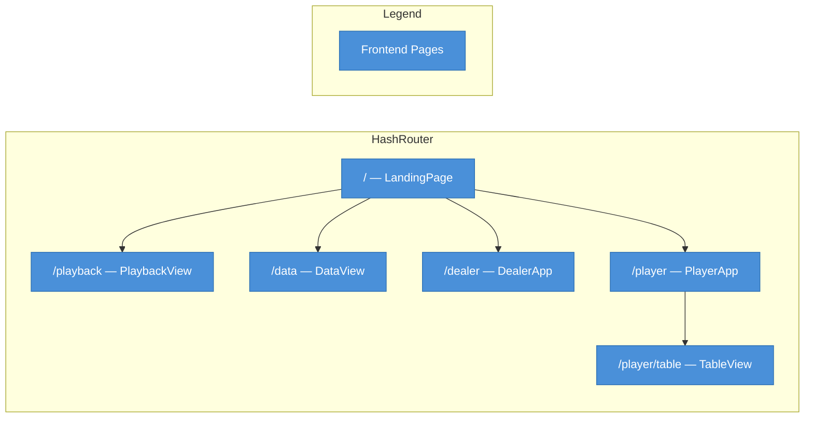
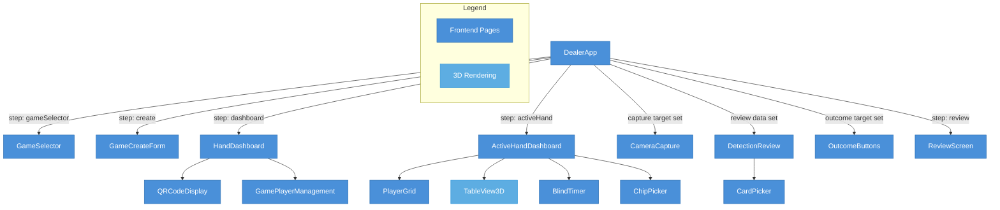
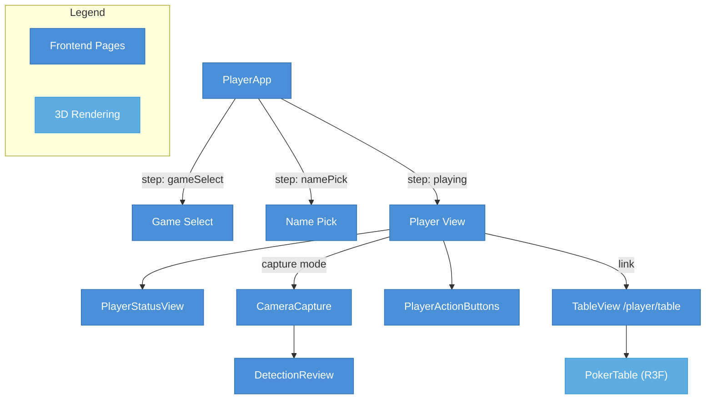
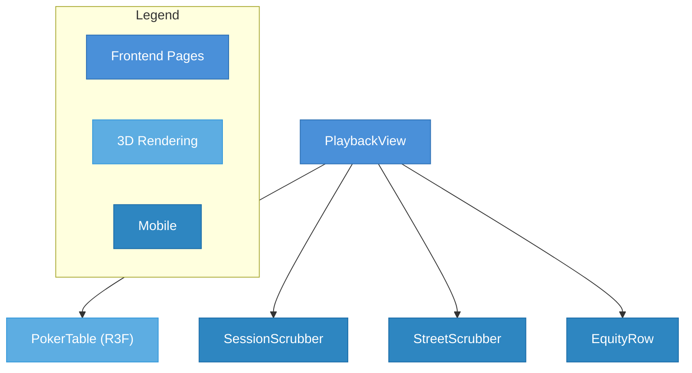
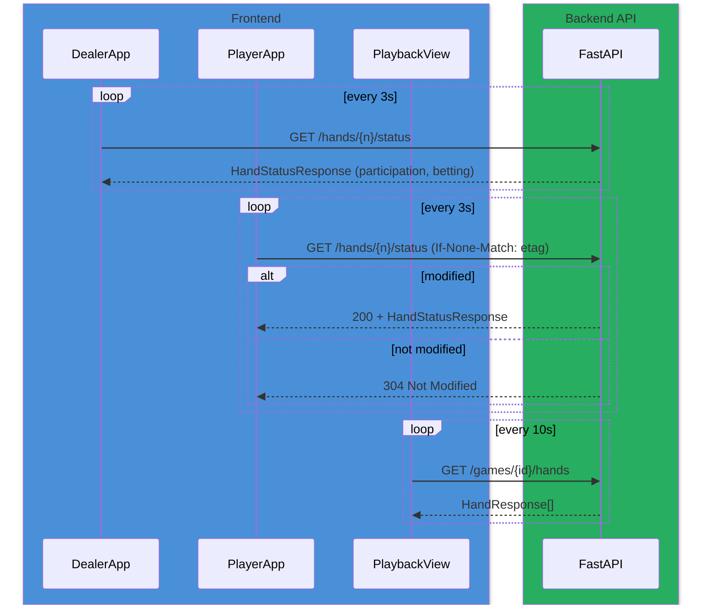
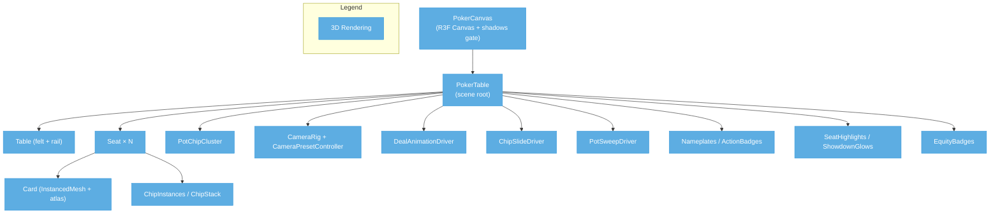

# Frontend Architecture — All In Analytics

| Field | Value |
|---|---|
| **Title** | Frontend Architecture |
| **Date** | 2026-04-14 |
| **Author** | Kurt (Nightcrawler) |
| **Scope** | `frontend/src/` — all layers |
| **Status** | Current |

---

## Table of Contents

1. [Overview](#overview)
2. [Tech Stack](#tech-stack)
3. [Directory Structure](#directory-structure)
4. [Routing](#routing)
5. [Component Hierarchy](#component-hierarchy)
6. [State Management](#state-management)
7. [API Client Layer](#api-client-layer)
8. [Polling Architecture](#polling-architecture)
9. [3D Rendering (React Three Fiber)](#3d-rendering-react-three-fiber)
10. [Poker Logic](#poker-logic)
11. [Mobile Adaptations](#mobile-adaptations)
12. [Build & Dev](#build--dev)
13. [Testing](#testing)
14. [Cross-References](#cross-references)

---

## Overview

The All In Analytics frontend is a React 19 + TypeScript single-page application that provides three distinct user experiences:

- **Dealer interface** — run a live poker game: create sessions, start hands, capture cards via camera, record outcomes, manage player participation and betting
- **Player interface** — join a session via QR code, capture hole cards, submit betting actions, and view a personalized 3D table
- **Playback / Data interface** — review recorded sessions with a 3D poker table, scrub through hands and streets, and import/export data via CSV or ZIP

All three share a common API client, Zustand state store, declarative React Three Fiber scene (`<PokerTable>`), and component library.

---

## Tech Stack

| Layer | Technology | Version |
|---|---|---|
| UI framework | React | 19.1 |
| Language | TypeScript | 5.8 |
| Build tool | Vite | 8.0 |
| Routing | react-router-dom (HashRouter) | 7.5 |
| State | Zustand (with `persist` middleware) | 5.0 |
| 3D rendering | React Three Fiber + drei (Three.js) | 9.x / 10.x / 0.183 |
| QR codes | qrcode | 1.5 |
| Test runner | Vitest + @testing-library/react | 4.1 / 16.3 |
| DOM environment | happy-dom | 20.8 |
| Linter | ESLint + @typescript-eslint | 9.x / 8.x |

---

## Directory Structure

```
frontend/src/
├── main.tsx                  # ReactDOM entry point
├── App.tsx                   # Root component — HashRouter + Routes
├── NavBar.tsx                # Top navigation bar
├── style.css                 # Global CSS custom properties & resets
│
├── api/                      # ── API Client Layer ──
│   ├── client.ts             # 40+ typed fetch functions
│   └── types.ts              # ~40 TypeScript interfaces (mirrors Pydantic)
│
├── hooks/                    # ── Custom Hooks ──
│   ├── usePolling.ts         # Generic interval polling with reconnection
│   └── useHandPolling.ts     # Hand-specific polling with auto-advance
│
├── stores/                   # ── State Management ──
│   └── dealerStore.ts        # Zustand store (persisted to sessionStorage)
│
├── dealer/                   # ── Dealer Interface ──
│   ├── DealerApp.tsx         # Orchestrator — step-based wizard
│   ├── GameSelector.tsx      # Game list + selection
│   ├── GameCreateForm.tsx    # New game form (date, players, buy-in)
│   ├── HandDashboard.tsx     # Hand list, start hand, end game
│   ├── ActiveHandDashboard.tsx  # Live hand: player tiles, betting, 3D toggle
│   ├── CameraCapture.tsx     # Camera input → upload → detection
│   ├── DetectionReview.tsx   # Review/correct detected cards
│   ├── CardPicker.tsx        # Manual 52-card grid selector
│   ├── ChipPicker.tsx        # Chip denomination selector
│   ├── OutcomeButtons.tsx    # Won / Folded / Lost / Not Playing
│   ├── ReviewScreen.tsx      # Editable hand review before finish
│   ├── PlayerGrid.tsx        # Player + street tile grid
│   ├── QRCodeDisplay.tsx     # QR code for player join URL
│   ├── GamePlayerManagement.tsx  # Add/remove/toggle players mid-game
│   ├── TableView3D.tsx       # Embedded 3D table in dealer view
│   ├── BlindTimer.tsx        # Blind level countdown timer
│   ├── dealerState.ts        # Legacy reducer types (re-exports from store)
│   └── showdownHelpers.ts    # Outcome inference from equity data
│
├── player/                   # ── Player Interface ──
│   ├── PlayerApp.tsx         # Orchestrator — game select → play
│   └── PlayerActionButtons.tsx  # Fold / Check / Call / Bet / Raise
│
├── views/                    # ── Full-Page Views ──
│   ├── LandingPage.tsx       # Home page with navigation cards
│   ├── DataView.tsx          # Session list, CSV/ZIP upload, CRUD
│   └── PlaybackView.tsx      # Session replay — mounts <SessionReplayShell> + <PokerCanvas><PokerTable>
│
├── pages/                    # ── Route Pages ──
│   └── TableView.tsx         # Per-player 3D table (polled updates)
│
├── components/               # ── Shared Components ──
│   ├── SessionScrubber.tsx   # Hand navigation (range slider + buttons)
│   ├── StreetScrubber.tsx    # Street navigation (5 buttons)
│   ├── EquityOverlay.tsx     # Per-seat equity badges over 3D scene
│   ├── PlayingCard.tsx       # Visual card with rank + suit
│   ├── HandEditForm.tsx      # Inline community/hole card editor
│   ├── SeatPicker.tsx        # Oval seat selection layout
│   ├── StatsSidebar.tsx      # Cumulative P/L table
│   ├── ResultOverlay.tsx     # Hand result popup
│   ├── BlindPositionDisplay.tsx  # SB/BB labels + blind level
│   ├── SessionForm.tsx       # Session creation form (non-dealer)
│   ├── PlayerManagement.tsx  # Player CRUD list
│   └── cardUtils.ts          # Card validation / normalization
│
├── scenes3d/                 # ── Declarative R3F Poker Scene ──
│   ├── PokerCanvas.tsx       # R3F <Canvas> wrapper — sizing, quality-tier shadows
│   ├── PokerTable.tsx        # <PokerTable> public component — composes the full scene
│   ├── SessionReplayShell.tsx # Replay driver — crosses-hand timeline + <HandScrubberPanel>
│   ├── index.ts              # Public exports (PokerTable, PokerCanvas, store, tiers, hooks)
│   ├── types.ts              # TableState, ViewerContext, QualityTier, Policy
│   ├── components/           # Leaf render components
│   │   ├── Table.tsx         # Elliptical felt + rail (PBR materials)
│   │   ├── Seat.tsx          # Per-seat group (anchor for cards + chips + overlays)
│   │   ├── Card.tsx          # InstancedMesh card (atlas-backed UV lookup)
│   │   ├── CardAtlas.ts      # 52-face texture atlas (resolution per tier)
│   │   ├── ChipInstances.tsx # InstancedMesh chips (denomination palette)
│   │   ├── ChipStack.tsx     # Per-seat / pot committed stacks
│   │   ├── PotChipCluster.tsx # Center-table pot cluster
│   │   ├── Nameplate.tsx     # DOM-projected seat nameplates
│   │   ├── ActionBadge.tsx   # Per-seat action/status badges
│   │   ├── EquityBadge.tsx   # Spectator-only equity overlay
│   │   ├── SeatHighlight.tsx # Seat ring + <ShowdownGlows> winner envelope
│   │   ├── DealerButton.tsx  # Dealer button + blind markers
│   │   ├── CameraRig.tsx     # Spectator orbit / player-POV rig
│   │   ├── CameraPresetController.tsx # Preset tween controller
│   │   ├── CameraPresetToolbar.tsx    # UI for preset selection
│   │   ├── TableSettingsPanel.tsx     # Theme + quality-tier controls
│   │   ├── QualityToast.tsx           # Auto-degrade notification surface
│   │   ├── HandScrubberPanel.tsx      # Hand + street scrubber (replay)
│   │   ├── tableLayout.ts    # Seat / pot / chip world-position math
│   │   └── tableMaterials.ts # PBR felt + rail materials
│   ├── animations/           # Controller (pure) + Driver (R3F) split
│   │   ├── DealAnimationController.ts / DealAnimationDriver.tsx
│   │   ├── ChipSlideController.ts     / ChipSlideDriver.tsx
│   │   ├── PotSweepController.ts      / PotSweepDriver.tsx
│   │   ├── cameraPresets.ts  # Preset poses + seat-POV math
│   │   ├── chipMotion.ts, chipSlides.ts, dealCards.ts, potSweeps.ts, presets.ts, tweens.ts
│   ├── data/                 # React Query hooks + payload adapters
│   │   ├── useTableStateQuery.ts, useEquityQuery.ts, handsToTableState.ts
│   └── state/                # Zustand slice + pure policies
│       ├── tableStore.ts     # qualityTier, manualOverride, theme, replay
│       ├── qualitySettings.ts # QUALITY_TIER_SETTINGS canonical map
│       ├── useFPSMonitor.ts  # 120-sample rolling FPS + auto-degrade
│       ├── visibilityPolicy.ts # canSee() hole-card presentation filter
│       ├── useReducedMotion.ts, equityGuard.ts
│
├── mobile/                   # ── Mobile-Specific Components ──
│   ├── EquityRow.tsx         # Horizontal scrollable equity cards
│   ├── SessionScrubber.tsx   # Touch-friendly hand nav (48px targets)
│   └── StreetScrubber.tsx    # Touch-friendly street nav (48px targets)
│
└── test/                     # ── Test Setup ──
    └── setup.ts              # Vitest global setup
```

---

## Routing

The app uses `HashRouter` — all routes are prefixed with `#/` in the URL.

| Route | Component | Purpose |
|---|---|---|
| `/` | `LandingPage` | Home screen — navigation cards to each section |
| `/playback` | `PlaybackView` | Session replay — `<SessionReplayShell>` + `<PokerCanvas><PokerTable viewer=spectator equityOverlay>` |
| `/data` | `DataView` | Session list, create game, CSV/ZIP import/export |
| `/dealer` | `DealerApp` | Dealer interface — full game management |
| `/player` | `PlayerApp` | Player interface — join and play |
| `/player/table` | `TableView` | Per-player 3D table with seat camera |

The `NavBar` renders navigation links and disables the Playback link when a dealer game is active (to prevent stale state conflicts).


```mermaid
flowchart LR
    subgraph "HashRouter"
        direction TB
        root["/ — LandingPage"]:::fe
        playback["/playback — PlaybackView"]:::fe
        data["/data — DataView"]:::fe
        dealer["/dealer — DealerApp"]:::fe
        player["/player — PlayerApp"]:::fe
        table["/player/table — TableView"]:::fe
    end

    root --> playback
    root --> data
    root --> dealer
    root --> player
    player --> table

    classDef fe fill:#4A90D9,stroke:#2C6FB3,color:#FFFFFF

    subgraph Legend
        direction LR
        L1[Frontend Pages]:::fe
    end
```

---

## Component Hierarchy

### Dealer Flow

The `DealerApp` orchestrates a step-based wizard. The `currentStep` field in the Zustand store drives which component renders.


```mermaid
flowchart TD
    DA["DealerApp"]:::fe
    GS["GameSelector"]:::fe
    GCF["GameCreateForm"]:::fe
    HD["HandDashboard"]:::fe
    AHD["ActiveHandDashboard"]:::fe
    CC["CameraCapture"]:::fe
    DR["DetectionReview"]:::fe
    OB["OutcomeButtons"]:::fe
    RS["ReviewScreen"]:::fe
    PG["PlayerGrid"]:::fe
    QR["QRCodeDisplay"]:::fe
    GPM["GamePlayerManagement"]:::fe
    TV3D["TableView3D"]:::fe3d
    BT["BlindTimer"]:::fe
    CP["CardPicker"]:::fe
    ChP["ChipPicker"]:::fe

    DA -->|"step: gameSelector"| GS
    DA -->|"step: create"| GCF
    DA -->|"step: dashboard"| HD
    DA -->|"step: activeHand"| AHD
    DA -->|"capture target set"| CC
    DA -->|"review data set"| DR
    DA -->|"outcome target set"| OB
    DA -->|"step: review"| RS

    HD --> QR
    HD --> GPM
    AHD --> PG
    AHD --> TV3D
    AHD --> BT
    DR --> CP
    AHD --> ChP

    classDef fe fill:#4A90D9,stroke:#2C6FB3,color:#FFFFFF
    classDef fe3d fill:#5DADE2,stroke:#3498DB,color:#FFFFFF

    subgraph Legend
        direction LR
        L1[Frontend Pages]:::fe
        L2[3D Rendering]:::fe3d
    end
```

**Dealer step transitions:**

| Step | Component | Next Step |
|---|---|---|
| `gameSelector` | `GameSelector` | `create` or `dashboard` |
| `create` | `GameCreateForm` | `dashboard` |
| `dashboard` | `HandDashboard` | `activeHand` (on hand select/start) |
| `activeHand` | `ActiveHandDashboard` | `review` (on finish) or camera/outcome |
| `review` | `ReviewScreen` | `dashboard` (on save) |

### Player Flow


```mermaid
flowchart TD
    PA["PlayerApp"]:::fe
    GS2["Game Select"]:::fe
    NP["Name Pick"]:::fe
    PV["Player View"]:::fe
    PSV["PlayerStatusView"]:::fe
    CC2["CameraCapture"]:::fe
    DR2["DetectionReview"]:::fe
    PAB["PlayerActionButtons"]:::fe
    TV["TableView /player/table"]:::fe
    PS["PokerTable (R3F)"]:::fe3d

    PA -->|"step: gameSelect"| GS2
    PA -->|"step: namePick"| NP
    PA -->|"step: playing"| PV
    PV --> PSV
    PV -->|"capture mode"| CC2
    CC2 --> DR2
    PV --> PAB
    PV -->|"link"| TV
    TV --> PS

    classDef fe fill:#4A90D9,stroke:#2C6FB3,color:#FFFFFF
    classDef fe3d fill:#5DADE2,stroke:#3498DB,color:#FFFFFF

    subgraph Legend
        direction LR
        L1[Frontend Pages]:::fe
        L2[3D Rendering]:::fe3d
    end
```

### Playback Flow


```mermaid
flowchart TD
    PV["PlaybackView"]:::fe
    PS["PokerTable (R3F)"]:::fe3d
    SS["SessionScrubber"]:::mob
    StS["StreetScrubber"]:::mob
    EQ["EquityRow"]:::mob

    PV --> PS
    PV --> SS
    PV --> StS
    PV --> EQ

    classDef fe fill:#4A90D9,stroke:#2C6FB3,color:#FFFFFF
    classDef fe3d fill:#5DADE2,stroke:#3498DB,color:#FFFFFF
    classDef mob fill:#2E86C1,stroke:#1B6CA8,color:#FFFFFF

    subgraph Legend
        direction LR
        L1[Frontend Pages]:::fe
        L2[3D Rendering]:::fe3d
        L3[Mobile]:::mob
    end
```

---

## State Management

### Zustand Store — `dealerStore.ts`

The primary application state is managed by a single Zustand store with `persist` middleware, which writes to `sessionStorage` (survives page refreshes within a tab).

**State shape:**

| Field | Type | Purpose |
|---|---|---|
| `gameId` | `number \| null` | Active game session ID |
| `currentHandId` | `number \| null` | Current hand number |
| `players` | `Player[]` | Player name, cards, status, outcome |
| `community` | `CommunityCards` | Flop/turn/river cards + recorded flags |
| `currentStep` | `string` | Wizard step: `gameSelector`, `create`, `dashboard`, `activeHand`, `review` |
| `handCount` | `number` | Running count of hands dealt |
| `gameDate` | `string \| null` | Game date string |
| `sbPlayerName` | `string \| null` | Small blind player |
| `bbPlayerName` | `string \| null` | Big blind player |

**Player state within a hand:**

| Field | Type | Purpose |
|---|---|---|
| `name` | `string` | Player name |
| `card1`, `card2` | `string \| null` | Hole cards |
| `recorded` | `boolean` | Whether cards have been submitted |
| `status` | `string` | `playing`, `idle`, `pending`, `joined`, `folded`, `won`, `lost`, `not_playing`, `handed_back` |
| `outcomeStreet` | `string \| null` | Street where outcome was decided |
| `lastAction` | `string \| null` | Last betting action |

**Key actions:** `setGame`, `setPlayerCards`, `setFlopCards`, `setTurnCard`, `setRiverCard`, `setHandId`, `setPlayerResult`, `newHand`, `finishHand`, `reset`, `loadHand`, `updateParticipation`, `setStep`

### Validation

`validateOutcomeStreets()` enforces poker rules before a hand can be finished:
- All showdown players (won/lost) must share the same outcome street
- Folders must fold on or before the showdown street

### Legacy `dealerState.ts`

A `useReducer`-based reducer is preserved for backward compatibility. It re-exports types from the Zustand store and defines action types (`DealerAction` union). The reducer implements the same logic as the store actions.

---

## API Client Layer

### `api/client.ts`

A centralized HTTP client with 40+ typed functions. All requests route through a shared `request<T>()` helper that:
- Prepends `VITE_API_BASE_URL` (or empty string for same-origin)
- Accepts `AbortSignal` for cancellation
- Throws `Error` with HTTP status and response body on failure
- Returns typed JSON responses

**Function categories:**

| Category | Functions | HTTP Methods |
|---|---|---|
| **Sessions** | `fetchSessions`, `fetchGame`, `createSession`, `completeGame`, `reactivateGame`, `deleteGame` | GET, POST, PATCH, DELETE |
| **Hands** | `fetchHands`, `fetchHand`, `fetchLatestHand`, `createHand`, `startHand`, `deleteHand` | GET, POST, DELETE |
| **Players** | `fetchPlayers`, `createPlayer`, `addPlayerToGame`, `togglePlayerStatus`, `assignPlayerSeat` | GET, POST, PATCH |
| **Hand cards** | `addPlayerToHand`, `updateHolecards`, `updateCommunityCards`, `updateFlop`, `updateTurn`, `updateRiver` | POST, PATCH |
| **Results** | `patchPlayerResult` | PATCH |
| **Actions** | `recordPlayerAction`, `fetchHandActions` | POST, GET |
| **Status** | `fetchHandStatus`, `fetchHandStatusConditional` (ETag) | GET |
| **Stats** | `fetchPlayerStats`, `fetchGameStats`, `fetchLeaderboard` | GET |
| **Equity** | `fetchEquity`, `fetchPlayerEquity` | GET |
| **Blinds** | `fetchBlinds`, `updateBlinds` | GET, PATCH |
| **Rebuys** | `createRebuy` | POST |
| **Upload** | `uploadCsvValidate`, `uploadCsvCommit`, `uploadZipValidate`, `uploadZipCommit`, `uploadImage`, `getDetectionResults` | POST, GET |
| **Export** | `exportGameCsvUrl`, `exportGameZipUrl` | URL builders |
| **Schema** | `fetchCsvSchema` | GET |

### `api/types.ts`

~40 TypeScript interfaces that mirror the backend Pydantic models. Key types:

| Interface | Purpose |
|---|---|
| `GameSessionResponse` | Full game session with players and metadata |
| `HandResponse` | Hand with community cards + `PlayerHandResponse[]` |
| `PlayerHandResponse` | Per-player cards, result, profit/loss |
| `HandStatusResponse` | Polling response: participation, betting state, pot |
| `CardDetectionEntry` | YOLO detection: value, confidence, bbox, alternatives |
| `EquityResponse` | Per-player equity percentages |
| `BlindsResponse` | Blind levels + timer state |
| `PlayerActionCreate` | Betting action: street, action, amount |

**Enum-like types:** `ResultEnum` (`won | folded | lost | handed_back`), `StreetEnum` (`preflop | flop | turn | river`), `ActionEnum` (`fold | check | call | bet | raise`)

---

## Polling Architecture

Polling is the primary real-time mechanism (no WebSocket).

### `usePolling` Hook

Generic polling with reconnection detection:
- Calls `fetchFn(signal)` on mount and every `intervalMs`
- Tracks `isReconnecting` state (set on fetch error, cleared on success)
- Exposes `triggerNow()` for immediate re-poll
- Properly aborts on unmount via `AbortController`

### `useHandPolling` Hook

Specialized for hand list polling:
- Polls `fetchHands()` every 10 seconds
- Detects new hands (count > previous count)
- Auto-advances to latest hand if viewer was already on the last hand
- Shows "new hand available" banner if viewer was on an earlier hand

### Polling in context

| Context | Hook | Interval | Endpoint |
|---|---|---|---|
| Dealer — active hand | `usePolling` | 3s | `GET /games/{id}/hands/{n}/status` |
| Player — playing | `usePolling` | 3s | `GET /games/{id}/hands/{n}/status` (conditional / ETag) |
| Player — blind display | `usePolling` | 10s | `GET /games/{id}/blinds` |
| Playback — table view | `useHandPolling` | 10s | `GET /games/{id}/hands` |
| Player — table view | `useHandPolling` | 10s | `GET /games/{id}/hands` |


```mermaid
sequenceDiagram
    box rgb(74, 144, 217) Frontend
        participant D as DealerApp
        participant P as PlayerApp
        participant PB as PlaybackView
    end
    box rgb(39, 174, 96) Backend API
        participant API as FastAPI
    end

    loop every 3s
        D->>API: GET /hands/{n}/status
        API-->>D: HandStatusResponse (participation, betting)
    end

    loop every 3s
        P->>API: GET /hands/{n}/status (If-None-Match: etag)
        alt modified
            API-->>P: 200 + HandStatusResponse
        else not modified
            API-->>P: 304 Not Modified
        end
    end

    loop every 10s
        PB->>API: GET /games/{id}/hands
        API-->>PB: HandResponse[]
    end
```

---

## 3D Rendering (React Three Fiber)

All 3D rendering lives in `frontend/src/scenes3d/` and is structured as a declarative React Three Fiber (R3F) component tree rooted at `<PokerTable>`. The legacy imperative `scenes/` factory was removed in T-033. Three.js is still the underlying renderer; it is driven through `@react-three/fiber` + `@react-three/drei` rather than direct scene-graph mutation.

### Public API — `<PokerCanvas>` + `<PokerTable>`

Consumer routes mount a two-layer stack:

```tsx
<PokerCanvas>
  <PokerTable
    state={tableState}            // Declarative TableState (seats, cards, pot, phase…)
    viewer={{ policy, seat }}     // 'spectator' | 'player' | 'observer'
    qualityTier={tier}            // 'low' | 'medium' | 'high' (from store)
    theme={{ mode, feltColor, … }}
    equityOverlay={spectatorOnly} // Hard-forced false for player policy
    cameraPreset="default"
  />
</PokerCanvas>
```

- **`<PokerCanvas>`** (`scenes3d/PokerCanvas.tsx`) — R3F `<Canvas>` wrapper. Reads `qualityTier` from the store and enables `shadows` only at `high`. Sizing is delegated to the container's `ResizeObserver` (R3F's internal one); no window-level resize listener.
- **`<PokerTable>`** (`scenes3d/PokerTable.tsx`) — declarative scene root. Composes `<Table>`, per-seat `<Seat>`, `<Card>`, `<ChipInstances>`/`<ChipStack>`, `<PotChipCluster>`, `<Nameplates>`, `<ActionBadges>`, `<SeatHighlights>` + `<ShowdownGlows>`, `<EquityBadges>`, `<CameraRig>` + `<CameraPresetController>`, and the three animation drivers (`DealAnimationDriver`, `ChipSlideDriver`, `PotSweepDriver`). Refer to `specs/table-3d-revamp-010/plan.md § Public API` for the full contract.

Public exports live in `scenes3d/index.ts`: `PokerTable`, `PokerCanvas`, `useTableStore`, `QUALITY_TIER_SETTINGS`, `useFPSMonitor`, `QualityToast`, `HandScrubberPanel`, `TableSettingsPanel`, camera-preset helpers, etc.

### Scene Graph


```mermaid
flowchart TD
    PC["PokerCanvas<br/>(R3F Canvas + shadows gate)"]:::fe3d
    PT["PokerTable<br/>(scene root)"]:::fe3d
    T["Table (felt + rail)"]:::fe3d
    S["Seat × N"]:::fe3d
    C["Card (InstancedMesh + atlas)"]:::fe3d
    CI["ChipInstances / ChipStack"]:::fe3d
    PCC["PotChipCluster"]:::fe3d
    CR["CameraRig + CameraPresetController"]:::fe3d
    DAD["DealAnimationDriver"]:::fe3d
    CSD["ChipSlideDriver"]:::fe3d
    PSD["PotSweepDriver"]:::fe3d
    NP["Nameplates / ActionBadges"]:::fe3d
    SH["SeatHighlights / ShowdownGlows"]:::fe3d
    EB["EquityBadges"]:::fe3d

    PC --> PT
    PT --> T
    PT --> S
    S --> C
    S --> CI
    PT --> PCC
    PT --> CR
    PT --> DAD
    PT --> CSD
    PT --> PSD
    PT --> NP
    PT --> SH
    PT --> EB

    classDef fe3d fill:#5DADE2,stroke:#3498DB,color:#FFFFFF

    subgraph Legend
        direction LR
        L1[3D Rendering]:::fe3d
    end
```

### Table Layout

Seat / pot / chip world positions are centralised in `scenes3d/components/tableLayout.ts` so render positions and animation targets share a single source of truth:

- Elliptical felt with $r_x = 3.5$, $r_z = 2.0$
- Seats distributed evenly around an outset ellipse (+0.8 units)
- `POT_CHIP_WORLD_POSITION` fixes the pot cluster at table centre
- `seatCommitChipWorldPosition(seat)` gives each seat's committed-chip origin (shared with `buildPokerTableChipSlideLayout`)

### Visibility Policy — `canSee()`

`scenes3d/state/visibilityPolicy.ts` exports a single pure function that every `<Card>.faceUp` decision routes through:

```ts
canSee({ viewerSeat, cardOwnerSeat, policy, phase, ownerFolded })
```

- **`spectator`** — opponents' hole cards reveal **only** at `phase === 'showdown'` for non-folded seats.
- **`player`** — viewer's own cards always visible; opponents hidden until showdown; folded opponents never reveal.
- **`observer`** — reserved policy; treated as spectator today.

> **Security note:** `canSee()` is a render-time **presentation** filter, not an authorisation gate. Hole cards that must be hidden from a given viewer must already be absent from the payload delivered by the backend. Defence-in-depth lives on the server (dealer-API visibility gate).

### Animation Architecture — Controller + Driver Split

Every animated effect is split into two files:

| Layer | File | Responsibility |
|---|---|---|
| Controller | `animations/*Controller.ts` | Pure logic — state machine, easing, tween math. Zero React, zero Three.js side effects. Directly unit-testable. |
| Driver | `animations/*Driver.tsx` | R3F component — mounts the controller via `useFrame`, wires it to scene refs, handles registry lookup. |

Current pairs: `DealAnimationController` / `DealAnimationDriver` (T-010), `ChipSlideController` / `ChipSlideDriver` (T-011), `PotSweepController` / `PotSweepDriver` (T-012). Each driver reads its controller's output every frame and applies it to the referenced meshes; the controller never imports Three.js.

### Quality Tiers & Auto-Degrade

Rendering quality is parameterised by a single `QualityTier` value (`'low' | 'medium' | 'high'`) persisted in the Zustand store slice `scenes3d/state/tableStore.ts`. The canonical mapping is in `scenes3d/state/qualitySettings.ts`:

- `QUALITY_TIER_SETTINGS[tier]` — the authoritative per-tier settings object (PBR on/off, env-map mode + resolution, shadow map size, AA mode, card atlas resolution, etc.). Every tier-gated value in the scene reads from this map — no inline `tier === 'high' ? …` literals.
- `useFPSMonitor` / `<FPSMonitor>` (`scenes3d/state/useFPSMonitor.ts`) — 120-sample rolling-window FPS monitor. When the average FPS stays below the degrade threshold for 3000 ms **and** `manualOverride` is false, it steps down to the `nextLowerTier` exactly once per recovery gate (requires at least one ≥30-avg frame before another drop). Never auto-upgrades; never drops below `low`.
- `<QualityToast>` (`scenes3d/components/QualityToast.tsx`) — dismissible DOM surface shown when an auto-degrade fires. Mounted at route-root for `/playback`, `/dealer`'s `<TableView3D>`, and `/player/table`.
- `<TableSettingsPanel>` exposes a tier radiogroup that calls `setTier(nextTier)` + `setManualOverride(true)`, halting auto-degrade so user choice sticks.

Default tier is resolved per device via `resolveDefaultQualityTier()` using `MOBILE_BREAKPOINT_PX`.

### Camera & Presets

`<CameraRig>` selects between the spectator orbit preset and the player seat-POV preset based on `viewer.policy`. Named presets (`'default'`, `'topDown'`, `'cinematic'`, `{ kind: 'seat', seat }`) are resolved to poses by `animations/cameraPresets.ts` and tweened by `<CameraPresetController>`. Under `viewer.policy === 'player'` the camera is hard-locked to the viewer's seat POV; a conflicting caller-supplied preset logs a DEV warning but the player seat still wins.

### Session Replay Composition

The `/playback` route composes replay primitives declaratively:

```tsx
<SessionReplayShell>                          {/* cross-hand timeline driver */}
  <HandScrubberPanel />                       {/* hand + street scrubber UI */}
  <PokerCanvas>
    <PokerTable viewer={{ policy: 'spectator' }} equityOverlay />
  </PokerCanvas>
</SessionReplayShell>
```

`<SessionReplayShell>` owns the `replay` store slice (`handIndex`, `streetIndex`, `isPlaying`, `speed`) and runs a single-`useEffect` auto-advance state machine: `max(CHIP_SLIDE_DURATION_MS, 1500 / speed)` ms per street, `1000 / speed` ms inter-hand pause, halt at last hand. `handsToTableState` (`data/handsToTableState.ts`) adapts backend `HandResponse[]` payloads into the declarative `TableState` consumed by `<PokerTable>`.

---

## Poker Logic

The legacy client-side hand evaluator (`poker/evaluator.ts`) and its Monte Carlo equity calculator were removed in T-033. Equity is now computed server-side and delivered through the hand payload / dedicated equity endpoint; `<PokerTable equityOverlay>` renders per-seat `<EquityBadge>` overlays from that server-supplied data.

### `components/cardUtils.ts`

Card validation utilities (still client-side):

- `isValidCard(str)` — validates rank (2–A) + suit (H/D/C/S)
- `normalizeCard(str)` — trims and uppercases
- `findDuplicateCards(cards)` — returns set of duplicate card codes

---

## Mobile Adaptations

The `mobile/` directory contains touch-optimized variants of shared components:

| Component | Adaptation |
|---|---|
| `SessionScrubber` | 48×48px touch targets, centered label, prev/next buttons |
| `StreetScrubber` | 48×48px buttons, `overflowX: auto`, flex-fill layout |
| `EquityRow` | Horizontal scroll, 80px min-width cards, color-coded equity |

`PlaybackView` composes `<SessionReplayShell>` + `<PokerCanvas><PokerTable>` and reuses the touch-optimized mobile scrubbers for narrow viewports (see § [Mobile Adaptations](#mobile-adaptations)).

`ActiveHandDashboard` detects viewport width via `matchMedia('(min-width: 600px)')` and adjusts layout accordingly.

The player interface (`PlayerApp`) uses `sessionStorage` for session persistence and opens the device camera via `<input type="file" accept="image/*" capture="environment">`.

---

## Build & Dev

### Vite Configuration

```typescript
// vite.config.ts
export default defineConfig({
  plugins: [react()],
  test: {
    environment: 'happy-dom',
    setupFiles: ['./src/test/setup.ts'],
  },
  server: {
    port: 5173,
    host: '0.0.0.0',
    proxy: {
      '/games': 'http://backend:8000',
      '/players': 'http://backend:8000',
      '/stats': 'http://backend:8000',
      '/upload': 'http://backend:8000',
      '/images': 'http://backend:8000',
      '/docs': 'http://backend:8000',
    },
  },
});
```

API calls in development are proxied to `http://backend:8000` (Docker Compose service name). In production, `VITE_API_BASE_URL` sets the backend origin.

### Commands

| Command | Purpose |
|---|---|
| `npm run dev` | Start Vite dev server on port 5173 |
| `npm run build` | Production build to `dist/` |
| `npm run preview` | Preview production build |
| `npm run lint` | ESLint check |

---

## Testing

Tests use **Vitest** with **@testing-library/react** and **happy-dom**.

Every component and module has a co-located test file (`*.test.tsx` or `*.test.ts`). Test files follow the naming convention `{ComponentName}.test.tsx`.

| Directory | Test count | What's tested |
|---|---|---|
| `dealer/` | 18 test files | All dealer components + state + helpers |
| `player/` | 2 test files | PlayerApp + PlayerActionButtons |
| `views/` | 3 test files | LandingPage, DataView, PlaybackView |
| `pages/` | 1 test file | TableView |
| `components/` | 12 test files | All shared components + cardUtils |
| `scenes3d/` | 46 test files | `<PokerTable>`, `<PokerCanvas>`, components, animations (controller + driver), state, policies |
| `hooks/` | 2 test files | usePolling + useHandPolling |
| `stores/` | 1 test file | dealerStore |
| `api/` | 1 test file | client |
| `mobile/` | 3 test files | EquityRow, SessionScrubber, StreetScrubber |
| Root | 3 test files | App, NavBar, vite-config |

---

## Cross-References

- Backend API documentation: [docs/backend/](../backend/) (routes, Pydantic models)
- Backend database models: [docs/backend/](../backend/) (SQLAlchemy schema)
- Specs: [specs/](../../specs/) — feature specifications
  - `dealer-interface-003/` — dealer interface spec
  - `dealer-viz-004/` — dealer visualization spec
  - `player-participation-005/` — player participation spec
  - `frontend-react-ts-006/` — frontend migration spec
  - `analytics-dashboard-007/` — analytics dashboard spec
- User onboarding guide: [docs/user-onboarding-guide.md](../user-onboarding-guide.md)
