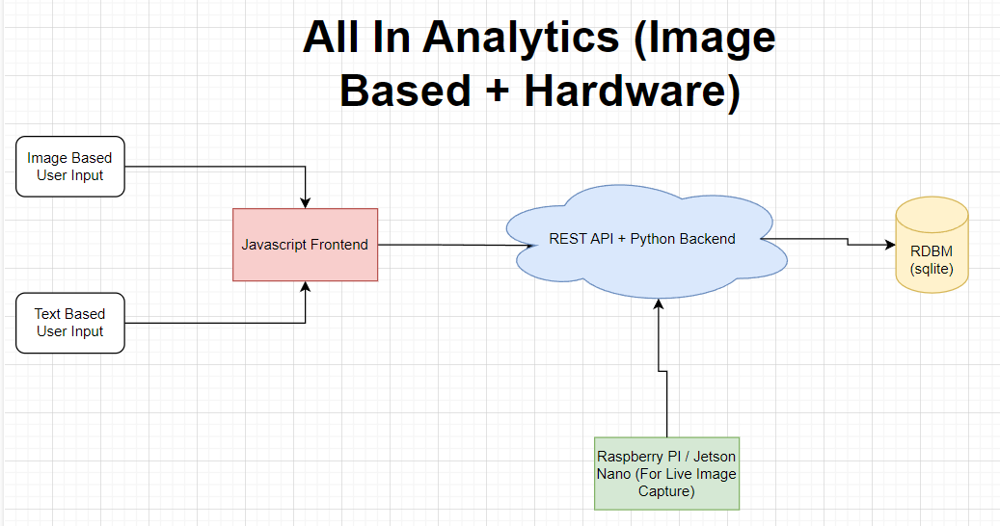

# Initial System Architecture

We will be developing and designing and automated 
historical hand tracking system for our bi-weekly 
poker games. There are many open questions here and the 
first thing we should define is an MVP (minimum viable product). 
Then there will be two more large iterations on this that should get 
us in a state to fully automate the entire process of 
tracking our hands. 

## V2 System Diagram

## Pilot (MVP): All In Analytics (w/o Images)

Above we can see the overall V2 system diagram. For the pilot
project we are interested in just supporting `Text Based`
user input on the client side. We will be completely ignoring 
the idea of images and getting most of the backend + frontend + DB
logic up to speed. I assume we should be able to interact with the platform
as follows:

- Initially there is no additional overhead on hosting. All
hosting will be done locally on our laptops, and we will store our
database as an in memory DBMS (using sqlite).
- Users should be able to bulk upload a `.csv` file containing some. 
agreed upon schema that denoted all the cards dealt to specific players
  (and community cards) in a given game. 
- Users should also be able to edit historical games on a card + player level.
- We can start ideating how we would integrate chips into this system. 

Overall, the pilot would basically be a much nicer and fully GUI based interactive
excel.

## V1: All In Analytics (Image Based)

To take it to the next level we will integrate a learning based backend 
that should allow us to monitor the table / cards in a given hand. We should be 
able to take an image of the table and be able to detect who has what hand and map that to our
internal logic. Users can then upload these sequentially and our DB should be populated as a result.

TODO: Add the individual points to get here

## V2: All In Analytics (Image Based + Hardware)

Finally, we will integrate hardware into our system to do communication 
with our backend API with no human in the loop. This will allow us to not have
to pause the game to collect data, and make the overall system have a seamless interface.

TODO: Add the individual points to get here