# All In Analytics — User Onboarding Guide

Welcome to **All In Analytics**, a poker session tracker and analysis tool for Texas Hold'em home games held at Bentley. This guide walks you through how to use the app as a **player**, a **dealer**, or a **data analyst**.

---

## Table of Contents

- [Getting Connected](#getting-connected)
- [Home Screen](#home-screen)
- [For Dealers](#for-dealers)
  - [Creating a Game](#creating-a-game)
  - [Managing Hands](#managing-hands)
  - [Recording Cards (Camera)](#recording-cards-camera)
  - [Recording Outcomes](#recording-outcomes)
  - [Sharing the QR Code](#sharing-the-qr-code)
  - [Participation Mode vs Dealer-Centric Mode](#participation-mode-vs-dealer-centric-mode)
  - [Ending a Game](#ending-a-game)
- [For Players](#for-players)
  - [Joining a Game](#joining-a-game)
  - [Capturing Your Hole Cards](#capturing-your-hole-cards)
  - [Handing Back Cards](#handing-back-cards)
  - [Player Status Flow](#player-status-flow)
- [For Data & Analytics](#for-data--analytics)
  - [Data View — Import & Export](#data-view--import--export)
  - [Playback View — 3D Table Replay](#playback-view--3d-table-replay)
  - [Stats & Leaderboard](#stats--leaderboard)
- [Tips & Troubleshooting](#tips--troubleshooting)

---

## Getting Connected

All In Analytics runs on a local network. The host starts the backend and frontend servers, and everyone at the table connects via their phone or laptop browser.

| What | URL |
|------|-----|
| Frontend (main UI) | `http://<host-ip>:5173` |
| Backend API docs | `http://<host-ip>:8000/docs` |

> **Tip:** If you're on the same Wi-Fi network, a cloudflare tunnel link will be given to you. The dealer can also share a QR code that takes you straight to the right page.

<!-- TODO: Screenshot of a phone browser navigating to the app URL -->

---

## Home Screen

When you open the app, you'll see the **landing page** with four navigation cards:

| Card | Purpose |
|------|---------|
| 🎬 **Playback** | Review recorded sessions on a 3D poker table |
| 🃏 **Dealer** | Run a live game (create sessions, record hands) |
| 👤 **Player** | Join a session and capture your own cards |
| 📊 **Data** | Import/export game data, manage sessions |

> **Note:** The Playback card is locked while a dealer has an active game in progress.

<!-- TODO: Screenshot of the landing page showing the four navigation cards -->


---

## For Dealers

The dealer is the person running the game — creating the session, starting hands, recording community cards, and logging outcomes.

### Creating a Game

1. Tap **Dealer** from the home screen.
2. If no game is in progress, you'll see a **game selector**. Tap **New Game**.
3. Pick a **date** (defaults to today).
4. **Select players** from the list, or add new players with the text input at the bottom.
5. Choose a **game mode**:
   - **Dealer-Centric** — the dealer captures all cards and records all outcomes.
   - **Participation** — players capture their own hole cards from their phones.
6. Tap **Create** (you need at least 2 players).

<!-- TODO: Screenshot of the Game Create Form with player selection and mode toggle -->

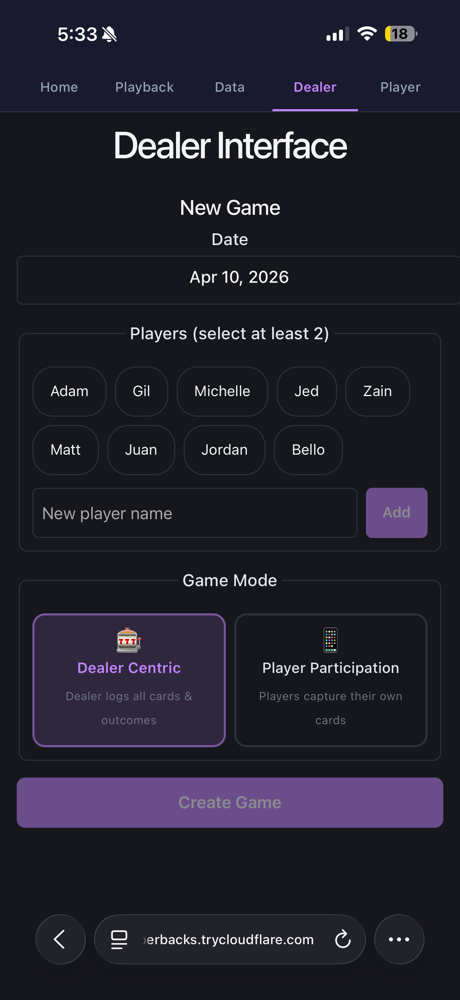

### Managing Hands

After creating a game, you land on the **Hand Dashboard**:

- Tap **New Hand** to start a new hand.
- Previous hands are listed with their outcomes — tap any hand to review or edit it.
- The hand count is displayed at the top.

<!-- TODO: Screenshot of the Hand Dashboard showing a list of hands -->


### Recording Cards (Camera)

On the **Player Grid** screen, you'll see tiles for each street (Flop, Turn, River) and each player:

1. **Community cards** — Tap the **Flop** tile to open the camera. Take a photo of the three flop cards. The app uses AI card detection system backed by the YOLO ([You Only Look Once](https://arxiv.org/pdf/1506.02640)) model to identify the cards automatically. Review the detected cards and confirm, edit, or retake.
2. After the flop is confirmed, the **Turn** tile unlocks. Same process — snap, review, confirm.
3. Then the **River** tile unlocks.
4. **Player hole cards** (dealer-centric mode) — Tap a player's tile to capture their two hole cards the same way.

<!-- TODO: Screenshot of the Player Grid showing street tiles (Flop ✅, Turn, River) and player tiles -->

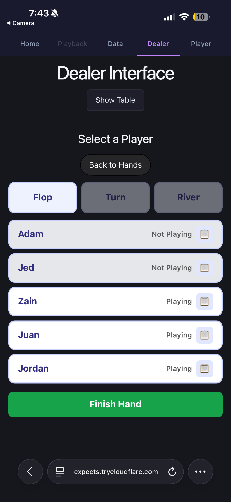

<!-- TODO: Screenshot of the Camera Capture screen -->
<!-- TODO: Screenshot of the Detection Review screen showing detected cards with edit options -->

<table><tr>
<td>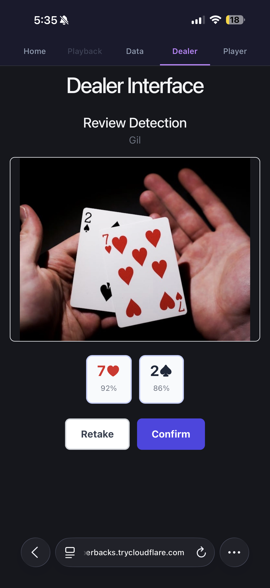</td>
<td>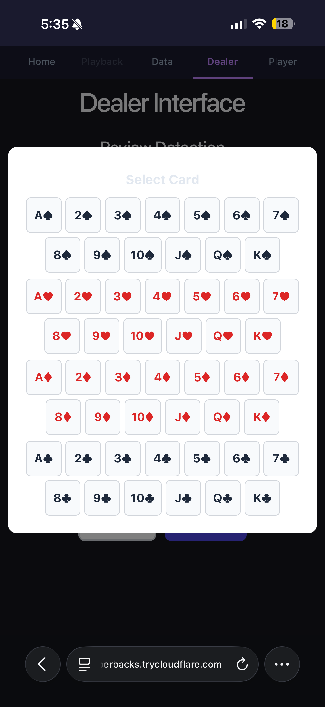</td>
<td>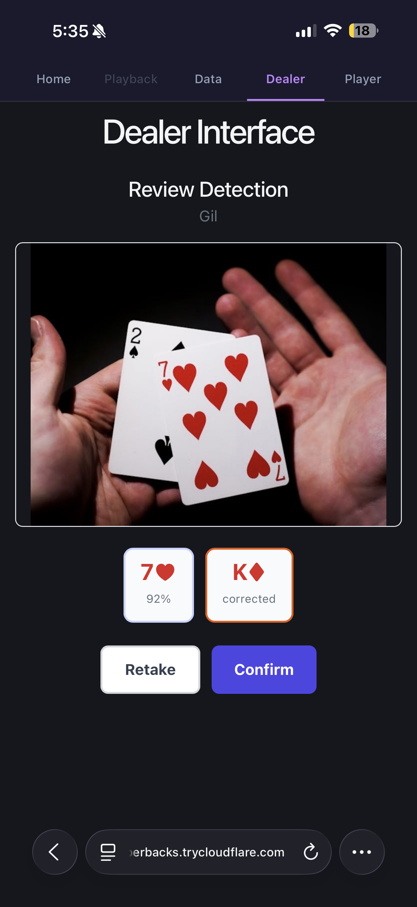</td>
</tr></table>


### Recording Outcomes

After cards are dealt, record what happened to each player:

1. Tap a player tile and select the **outcome icon** (or in participation mode, wait for the player to hand back their cards first).
2. Choose the result: **Won**, **Folded**, **Lost**, or **Not Playing**.
3. If the player won, folded, or lost, pick the **street** it happened on (Pre-Flop, Flop, Turn, or River).

<!-- TODO: Screenshot of the Outcome Buttons showing Won/Folded/Lost/Not Playing options -->

<!-- TODO: Screenshot of the street selection (Pre-Flop / Flop / Turn / River) -->

<table><tr>
<td>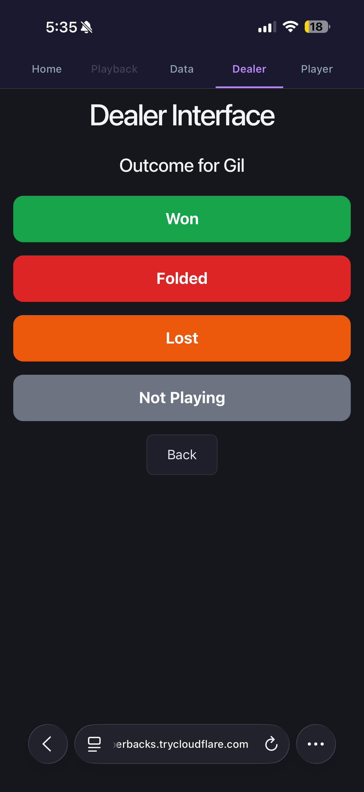</td>
<td>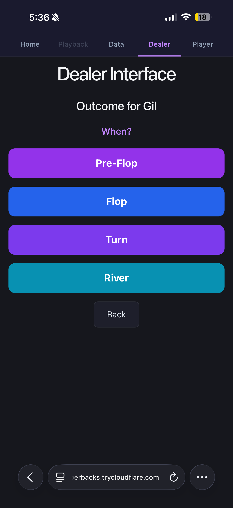</td>
</tr></table>


### Sharing the QR Code

On the Hand Dashboard, tap the **QR code button** to display a scannable QR code. Players can scan it to jump directly into the game's player view — no need to type URLs.

The QR code encodes the game ID (and optionally a specific player name) into the player URL.

> **Tip:** This is only available in the player participation mode.

<!-- TODO: Screenshot of the QR Code Display -->

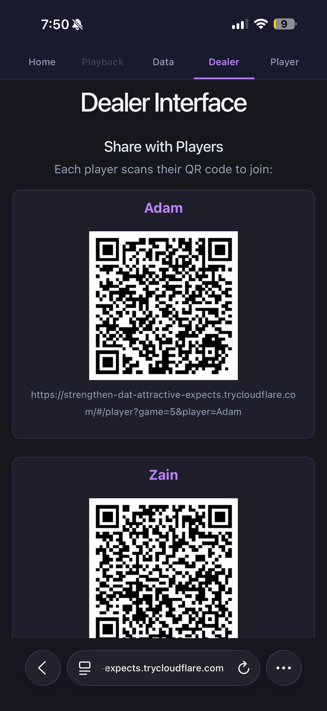


### Participation Mode vs Dealer-Centric Mode

| Feature | Dealer-Centric | Participation |
|---------|---------------|---------------|
| Who captures hole cards? | Dealer | Each player on their own phone |
| Who records outcomes? | Dealer | Dealer (after player hands back cards) |
| Player phone needed? | No | Yes |
| Player flow | Passive — dealer does everything | Active — players capture, then hand back |

In **participation mode**, the flow is:
1. Dealer starts a hand and taps a player tile to **activate** them.
2. The player's phone shows a "Capture" button.
3. The player photographs their hole cards and confirms.
4. The player taps **Hand Back** when they're done looking.
5. The dealer sees the player's status as "handed back" and can record the outcome.

<!-- TODO: Screenshot of the Player Grid in participation mode showing different player statuses (pending, joined, handed_back) -->

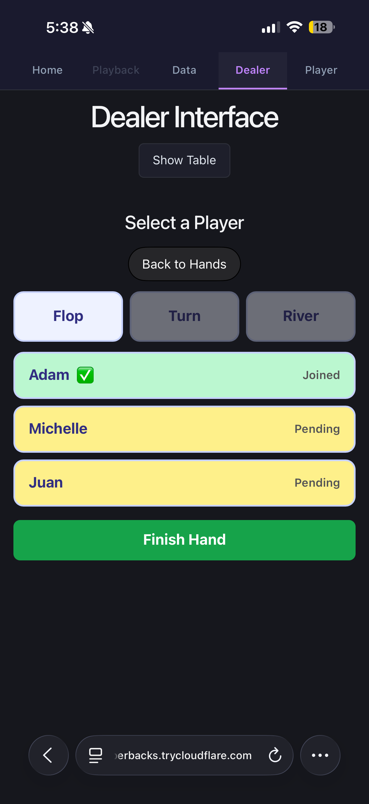

### Ending a Game

1. On the Hand Dashboard, tap **End Game**.
2. Select **1 or 2 winners** of the overall session.
3. Confirm — the game status changes to "completed" and it becomes available for playback and analysis.

<!-- TODO: Screenshot of the End Game confirmation with winner selection -->

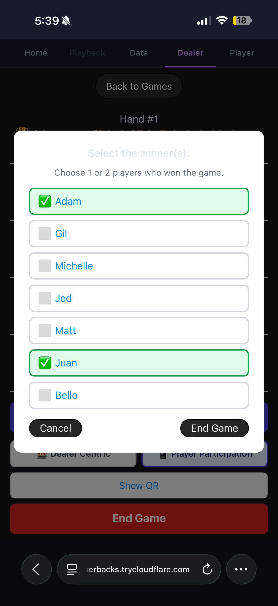

---

## For Players

Players join a game from their phone and interact through the **Player** view. This is designed to be simple and mobile-first.

### Joining a Game

There are two ways to join:

1. **Scan the QR code** — the dealer shows a QR code on their screen. Scan it with your phone camera. It opens the app with the game pre-selected.
2. **Browse active games** — tap **Player** on the home screen. You'll see a list of active game sessions. Tap one to join.

After selecting a game, **pick your name** from the player list.

<!-- TODO: Screenshot of the Player game selection screen showing active games -->
<!-- TODO: Screenshot of the Player name selection screen -->

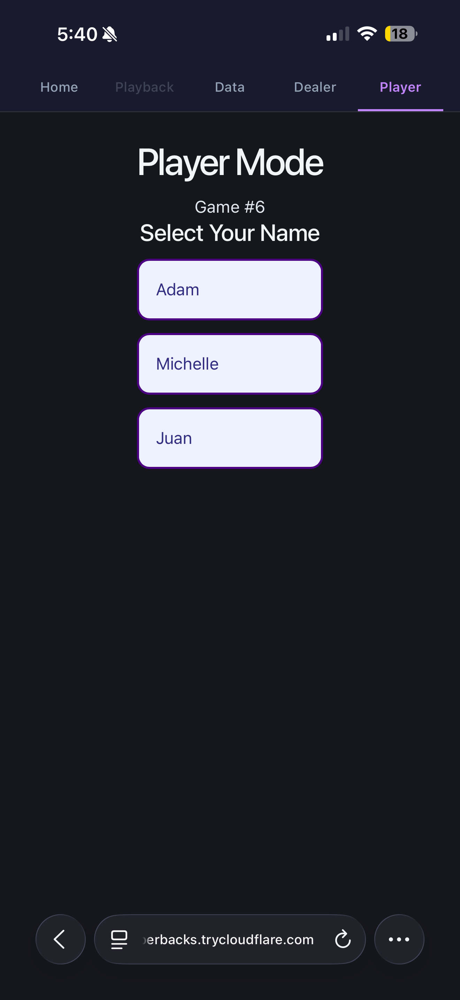


### Capturing Your Hole Cards

In **participation mode**, once the dealer activates you for a hand (this interface is identical to the dealers):

1. Your screen will show a **Capture** button.
2. Tap it to open the camera.
3. Photograph your two hole cards face-up.
4. The AI detects the cards — review and confirm (or edit if the detection missed).
5. Your cards are recorded. Only the backend knows them until showdown in the 3D playback.

<!-- TODO: Screenshot of the Player view showing the Capture button -->
<!-- TODO: Screenshot of the Player camera capture flow -->

<table><tr>
<td>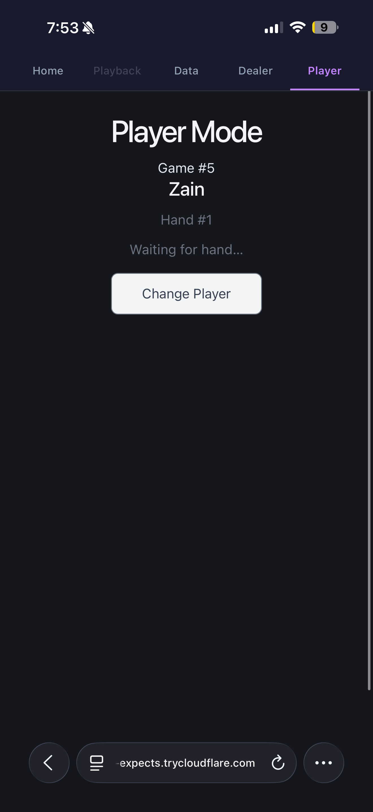</td>
<td>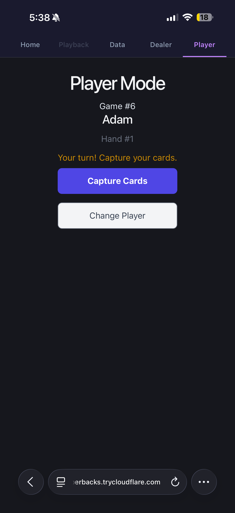</td>
</tr></table>

### Handing Back Cards

After capturing your cards and viewing them:

1. Tap the **Hand Back** button to indicate you're done.
2. Your status changes to "handed back" on the dealer's screen.
3. The dealer can then record your outcome (won, folded, lost).

<!-- TODO: Screenshot of the Player view showing the Hand Back button -->

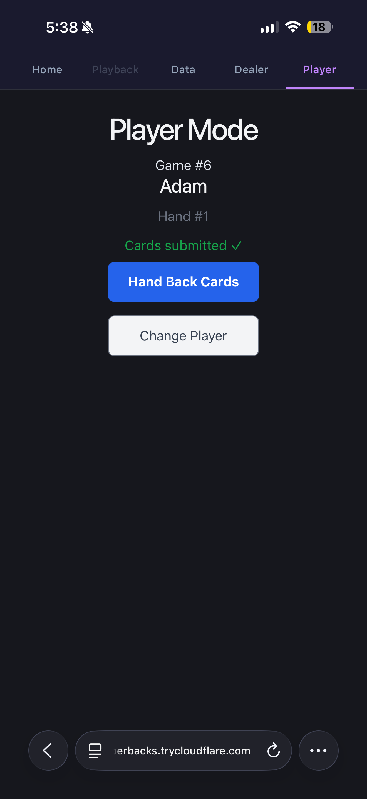

### Player Status Flow

Your status during a hand follows this progression:

```
idle → pending → joined → handed_back → (won / folded / lost)
```

| Status | What's happening |
|--------|-----------------|
| **idle** | No active hand, waiting for dealer |
| **pending** | Dealer activated you — waiting for you to capture cards |
| **joined** | You captured your hole cards |
| **handed_back** | You tapped "Hand Back" — dealer can record outcome |
| **won / folded / lost** | Final outcome recorded |

Your screen updates automatically every few seconds — no need to refresh.

---

## For Data & Analytics

### Data View — Import & Export

Tap **Data** on the home screen to manage your game history.

**Browsing sessions:**
- All sessions are listed in a sortable table (by date, status, hand count, player count).
- Click a session row to expand it and see individual hands.

**Creating a new session:**
- Click **New Game** to open the create modal.
- Pick a date, select players, and create.

**Importing from CSV:**
- Click the **Import CSV** button.
- Select your CSV file — the app validates the schema first and shows any errors.
- If validation passes, click **Commit** to import all the data.

**Exporting to CSV:**
- On any expanded session, click **Export CSV** to download the full session data.

**Editing hands:**
- Expand a session, click a hand row to edit community cards or individual player hole cards inline.

<table><tr>
<td>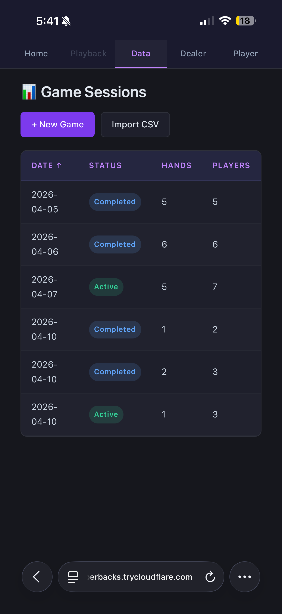</td>
<td>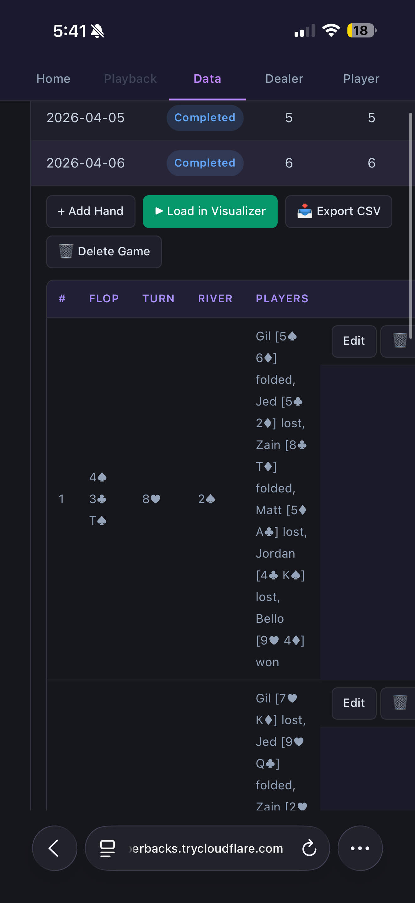</td>
</tr></table>

<!-- TODO: Screenshot of the CSV Import validation step -->
<!-- TODO: Screenshot of an expanded session showing hand details -->

### Playback View — 3D Table Replay

Tap **Playback** on the home screen to open the interactive 3D poker table.

**How it works:**

1. **Pick a session** from the left sidebar.
2. The 3D table loads with player seats, chip stacks, and cards.
3. Use the **hand scrubber** (slider at the bottom) to move between hands. Chip stacks show cumulative P&L.
4. Use the **street scrubber** to step through the hand: Pre-Flop → Flop → Turn → River → Showdown.
5. **Equity badges** appear above each player showing their win probability at the current street (requires at least 2 players with known hole cards).
6. At **Showdown**, all hole cards flip face-up (this doesn't happen lol)

**Controls:**
- **Click and drag** to orbit the camera around the table.
- **Scroll** to zoom in/out.
- **Right-click drag** to pan.

<!-- TODO: Screenshot of the Playback View showing the 3D table with cards and chips -->

<table><tr>
<td>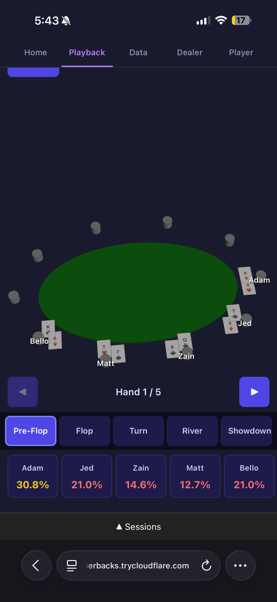</td>
<td></td>
</tr></table>


<!-- TODO: Screenshot showing the hand scrubber and street scrubber controls -->
<!-- TODO: Screenshot showing equity badges above player seats -->

### Stats & Leaderboard [WIP]

The API provides per-player and per-game statistics accessible via the backend:

- **Player stats** — total hands, win rate, average profit/loss.
- **Game stats** — hand count, player count, winners.
- **Leaderboard** — ranked player performance across all sessions.
- **Search** — search through hand history by player, cards, or results.

> **Note:** Stats can be accessed via the API at `http://<host-ip>:8000/docs` — look for the `/stats` and `/leaderboard` endpoints.

<!-- TODO: Screenshot of stats or leaderboard if/when a frontend view exists -->

---

## Tips & Troubleshooting

| Issue | Solution |
|-------|---------|
| Can't connect from phone | Make sure you're on the same Wi-Fi network as the host. |
| Camera not working | Make sure you've granted camera permissions in your browser. HTTPS is required on some browsers — the Cloudflare tunnel provides this for remote access. |
| Card detection is wrong | After the AI detects cards, you can **edit** the values before confirming. Tap a detected card to change it, or use the card picker. |
| Playback is locked | The Playback view is disabled while a dealer game is active. End the game first. |
| QR code won't scan | Try increasing screen brightness. Make sure you're scanning with a QR reader or your phone's native camera app. |
| Page doesn't update | The player view polls every 3 seconds automatically. If it seems stuck, pull down to refresh or reload the page. |
| CSV import fails | Check that your CSV matches the expected schema. The validation step will show specific errors for each row. |

---

## Quick Reference — URL Routes

| Route | View | Who uses it |
|-------|------|-------------|
| `#/` | Landing page | Everyone |
| `#/dealer` | Dealer interface | Dealer |
| `#/player` | Player interface | Players |
| `#/player?game=<id>` | Player (pre-selected game) | Players (via QR code) |
| `#/player?game=<id>&player=<name>` | Player (pre-selected game + name) | Players (via QR code) |
| `#/playback` | 3D table playback | Analytics / review |
| `#/data` | Data management | Analytics / dealer |
